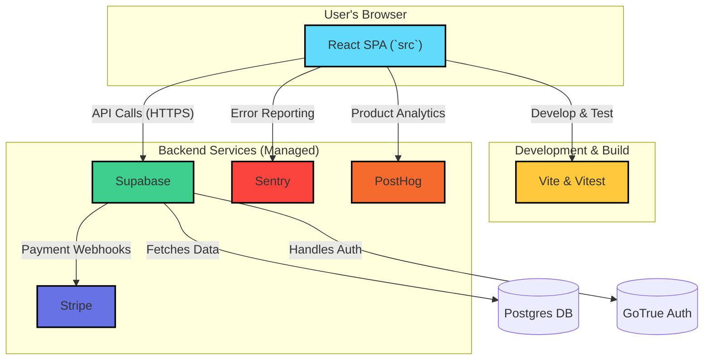

# System Architecture: SpeakSharp

## 1. Executive Summary

SpeakSharp is a **privacy-first, real-time speech analysis tool** designed as a modern, serverless SaaS web application. Its architecture is strategically aligned with the core product goal: to provide instant, on-device feedback that helps users improve their public speaking skills, while rigorously protecting their privacy.

The system is built for speed, both in user experience and development velocity. It leverages a **React (Vite)** frontend for a highly interactive UI and **Supabase** as an all-in-one backend for data, authentication, and user management. This stack was chosen to rapidly deliver a feature-rich MVP, focusing on the core value proposition of real-time, private speech analysis.

## 2. System Architecture & Technology Stack

The architecture is designed around a modern, client-heavy Jamstack approach, directly supporting the PRD's stated competitive edge of **"speed + privacy"**. The frontend is a sophisticated single-page application that handles most of the business logic, communicating with a managed backend service for data persistence and authentication. This minimizes server-side complexity and accelerates development.

### Technology Stack Breakdown

| Technology | Purpose | Implementation Location(s) & Notes |
| :--- | :--- | :--- |
| **React** | Frontend UI Library | The core of the application. Used to build all components and pages. • **`src/`**: Entire frontend application source. • **`src/pages/`**: Top-level page components. • **`src/components/`**: Reusable UI elements. |
| **Vite** | Build Tool & Dev Server | Provides a fast development experience and bundles the application for production. • **`vite.config.js`**: Main configuration file. • **`package.json`**: `dev`, `build`, `preview` scripts. |
| **Supabase** | Backend-as-a-Service | Provides the database, authentication, and APIs, drastically reducing backend work for the MVP. • **`src/lib/supabaseClient.js`**: Client initialization. • **`src/contexts/AuthContext.jsx`**: Handles auth state changes. • **`supabase/migrations/`**: Database schema definitions. |
| **Tailwind CSS** | Utility-First CSS | Used for all styling, enabling rapid UI development. • **`tailwind.config.cjs`**: Configuration and theme. • **`src/index.css`**: Base styles and imports. |
| **shadcn/ui** | UI Component Library | Provides a set of pre-built, accessible, and composable React components. • **`src/components/ui/`**: Location of all `shadcn` components. |
| **Vitest** | Test Runner | Used for all unit and integration testing. Chosen for its speed and seamless integration with Vite. • **`vitest.config.js`**: Test environment configuration. • **`src/__tests__/`**: Location of test files. |
| **Web Speech API** | Core Feature | Browser API used for on-device, real-time speech-to-text conversion. This is the heart of the privacy-first approach. • **`src/hooks/useSpeechRecognition.js`**: Hook that encapsulates all interaction with this API. |
| **Stripe** | Payments | Handles all subscription payments for the "Pro" tier. • **`supabase/migrations/...`**: `stripe_customer_id` is stored in `user_profiles` to link users to payments. Backend integration likely uses webhooks. |
| **Sentry** | Error Monitoring | Captures runtime errors and performance data to ensure a stable MVP. • **`src/main.jsx`**: Sentry is initialized and wraps the main App component. |
| **PostHog** | Product Analytics | Tracks user behavior, feature adoption, and conversion funnels. This directly supports the "Primary Success Metrics" outlined in the PRD. • *Implementation TBD, likely via a script or React SDK.* |
| **React Router** | Client-Side Routing | Manages navigation between different pages in the single-page application. • **`src/App.jsx`**: Route definitions. • **`src/main.jsx`**: `BrowserRouter` setup. |

## 3. The Test Environment and Suite

The testing strategy is designed for rapid feedback and reliability, directly supporting the goal of launching a stable MVP quickly.

*   **Framework**: The project uses **Vitest**, a modern test runner built on top of Vite. This choice is strategic: it shares the same configuration as the development server, making it exceptionally fast and simple to maintain. This speed is critical for a fast-paced MVP development cycle.
*   **Test Organization**: Tests are co-located with the code they validate (e.g., `src/__tests__`, `src/components/__tests__`), making them easy to find and run. They focus on testing individual components and hooks.
*   **Mocking (`src/test/setup.js`)**: A key part of the strategy is the robust mocking of browser-only APIs like `MediaRecorder` and `SpeechRecognition`. This allows the core logic of the application to be tested thoroughly in a lightweight `happy-dom` command-line environment, avoiding the need for slow, flaky, full-browser tests for every commit.
*   **Rationale vs. Alternatives**:
    *   **vs. Jest**: Vitest is faster and requires less configuration in a Vite project.
    *   **vs. Docker**: A Dockerized test environment would be overkill for this stage, adding complexity and slowing down the development loop. The current setup provides the right balance of confidence and speed for an MVP.

## 4. Alignment with PRD Goals

The entire system architecture is a direct reflection of the goals outlined in the **SpeakSharp PRD**.

*   **Goal: "Privacy-First, Real-Time Analysis"**:
    *   **Architecture**: The decision to use the browser's **Web Speech API** and perform all analysis on the client-side is the cornerstone of the privacy promise. The architecture ensures that raw audio never leaves the user's device for free-tier users.

*   **Goal: "Rapid MVP Launch" (3-Week Target)**:
    *   **Architecture**: The technology choices are optimized for development speed to meet the aggressive **3-week MVP timeline** defined in the PRD.
        *   **React + Vite + shadcn/ui**: Allows for rapid development of a modern, interactive frontend.
        *   **Supabase**: Provides a complete backend out-of-the-box, saving weeks of development time on building auth, user management, and a database API from scratch.
        *   **Vitest**: Enables a fast, reliable testing workflow, allowing developers to iterate with confidence.

*   **Goal: "Scalable Freemium Model"**:
    *   **Architecture**: The client-heavy architecture for free users is infinitely scalable at near-zero cost. The system is already designed to integrate with a serverless function for a "High-accuracy cloud transcription" feature for Pro users, demonstrating a clear and cost-effective path to scaling premium features. The database schema includes fields for `subscription_status` and `usage_seconds`, directly enabling the tiered pricing model.

In summary, the architecture is not just a technical blueprint; it is a well-considered plan to efficiently build, launch, and scale the exact product envisioned in the PRD.
