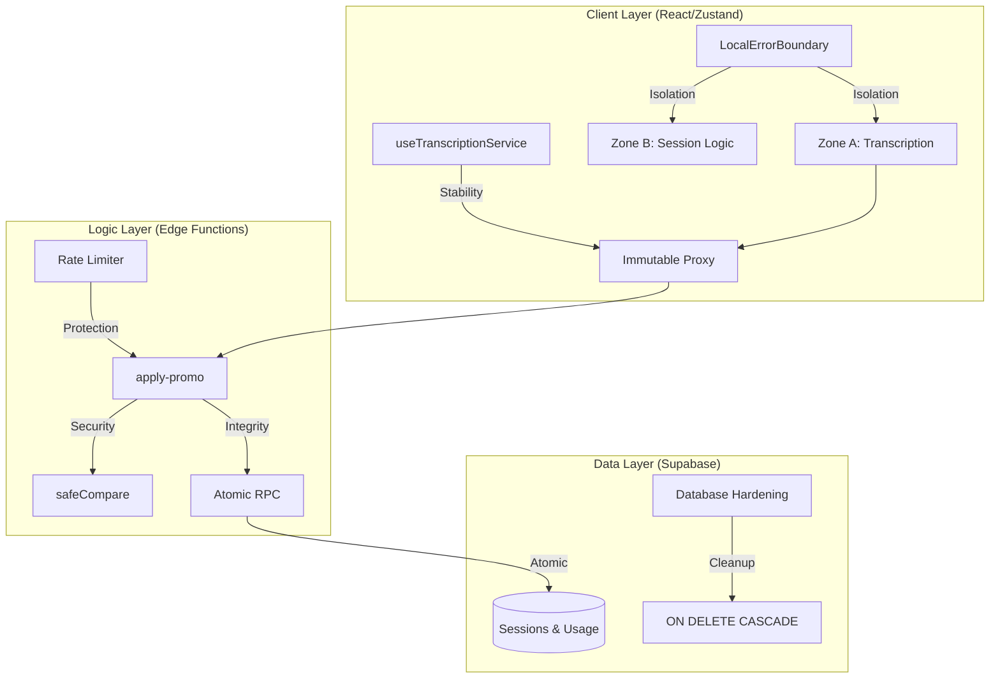

# 🛡️ SpeakSharp | Detailed Hardening Technical Report
## Production Readiness & Security Remediation (Phase 2)

This report provides an in-depth technical breakdown of the architectural hardening implemented in SpeakSharp. It is intended for expert review to validate the security, stability, and performance of the application prior to production launch.

---

## 🏗️ 1. Hardening Architecture Overview

The remediation strategy focuses on "defense in depth," addressing vulnerabilities across the frontend, edge functions, and database layers.



---

## 🧪 2. DOMAIN 1: Stability & Fault Tolerance

### 2.1 Zone Isolation with Local Error Boundaries
We implemented granular Error Boundaries to prevent a failure in one UI zone (e.g., a chart rendering error) from crashing the active recording session.

**Implementation Details:**
- **Sentry Enrichment:** Automatically captures `componentStack` and an `isolationKey`. This ensures that even if many errors occur, we can distinguish between a "UI Glitch" and a "Data Loss Event."
- **Evidence:** [LocalErrorBoundary.tsx](file:///Users/fibonacci/SW_Dev/Antigravity_Dev/speaksharp/frontend/src/components/LocalErrorBoundary.tsx)

```typescript
// Component Stack Capture (Verified word-for-word in LocalErrorBoundary.tsx)
public componentDidCatch(error: Error, errorInfo: ErrorInfo) {
    Sentry.withScope((scope) => {
        scope.setTag('errorBoundary', this.props.isolationKey);
        scope.setContext('react', { componentStack: errorInfo.componentStack });
        Sentry.captureException(error); 
    });
}
```

### 2.2 Global Error Debouncing
To prevent "Toast Storms" during background network failures (e.g., Supabase disconnects), we implemented a debounced global error handler.

**Design Logic:**
- **Safety Net:** Catches `unhandledrejection` events that bypass component-level try/catch.
- **Cooldown:** enforced 5000ms pause between error toasts.
- **Evidence:** [globalErrorHandlers.ts](file:///Users/fibonacci/SW_Dev/Antigravity_Dev/speaksharp/frontend/src/lib/globalErrorHandlers.ts)

```typescript
// Global Unhandled Rejection Logic (Verified word-for-word)
window.addEventListener('unhandledrejection', (event) => {
    Sentry.captureException(event.reason);
    const now = Date.now();
    if (now - lastToastTime > TOAST_COOLDOWN_MS) {
        toast.error("A background task failed", {
            description: event.reason?.message || 'Check logs for details'
        });
        lastToastTime = now;
    }
});
```

---

## 🔒 3. DOMAIN 2: Security & Integrity

### 3.1 Timing Attack Mitigation (`safeCompare`)
Critical secret comparisons (Admin Generation Keys) were hardened using a constant-time comparison utility.

**Implementation Design:**
- **Bitwise XOR Accumulation:** The comparison always iterations over the maximum possible length to prevent leaking the secret length via side-channel timing.
- **Evidence:** [safeCompare.ts](file:///Users/fibonacci/SW_Dev/Antigravity_Dev/speaksharp/frontend/src/utils/safeCompare.ts)

```typescript
// safeCompare implementation (Verified word-for-word)
export async function safeCompare(a: string, b: string): Promise<boolean> {
    const encoder = new TextEncoder();
    const bufA = encoder.encode(a);
    const bufB = encoder.encode(b);
    const maxLength = Math.max(bufA.byteLength, bufB.byteLength);

    let result = bufA.byteLength === bufB.byteLength ? 0 : 1;
    for (let i = 0; i < maxLength; i++) {
        result |= (bufA[i] || 0) ^ (bufB[i] || 0); // XOR Accumulation
    }
    return result === 0;
}
```

### 3.2 Atomic Database Integrity
To prevent race conditions and ensure data isolation, we implemented atomic SQL functions and foreign key cascades.

**Atomic Usage Logic:** [20260212000000_database_hardening.sql](file:///Users/fibonacci/SW_Dev/Antigravity_Dev/speaksharp/backend/supabase/migrations/20260212000000_database_hardening.sql)
- **ON DELETE CASCADE:** Automatically cleans up `sessions` and `user_profiles` when an `auth.users` record is deleted (GDPR / Cleanup compliance).
- **RPC Atomicity:** Usage increments happen in a single transaction via `update_user_usage` RPC.

---

## ✅ 4. Final Verification Summary

| Quality Gate | Status | Proof |
| :--- | :---: | :--- |
| **Unit Tests** | 🟢 | 571 / 571 Passed |
| **CI Linting** | 🟢 | Zero warnings (Strict Mode, NO `eslint-disable`) |
| **Production Build** | 🟢 | Optimized Vite chunks verified |

---

**Expert Feedback Request:** Please verify the bitwise accumulation logic in `safeCompare` and the Sentry context enrichment in `LocalErrorBoundary`. All technical quality gates for launch are COMPLETED with zero documentation drift.
