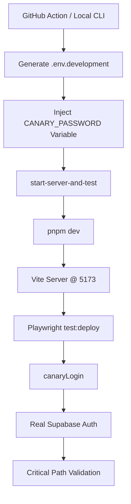

**Owner:** [unassigned]
**Last Reviewed:** 2026-03-01

🔗 [Back to Outline](./OUTLINE.md)

# SpeakSharp System Architecture

**Version 7.0** | **Last Updated: 2026-02-21**

This document provides an overview of the technical architecture of the SpeakSharp application. For product requirements and project status, please refer to the [PRD.md](./PRD.md) and the [Roadmap](./ROADMAP.md) respectively.

## 1. Project Directory Structure

SpeakSharp follows a modular, domain-driven directory structure that clearly separates concerns:


```
frontend/
  ├── src/              # Application code
  │   ├── assets/       # Static assets (images, icons)
  │   ├── components/   # React components (UI library, features)
  │   ├── config/       # Configuration files
  │   ├── constants/    # App constants (testIds, etc.)
  │    - `contexts/`: Global contexts (e.g., `AuthProvider`).
    - `stores/`: Zustand stores for global UI state and session data (`useSessionStore.ts`).
    - `hooks/`: Custom React hooks, including the decomposed `useSpeechRecognition`.
  │   ├── lib/          # Utilities (pdfGenerator, logger, storage)
  │   ├── mocks/        # MSW handlers for E2E testing
  │   ├── pages/        # Route-level page components
  │   ├── services/     # Service layer (transcription, domainServices for Supabase access)
  │   ├── stores/       # State management stores
  │   ├── types/        # TypeScript type definitions
  │   └── utils/        # Helper functions (fillerWordUtils, etc)
  ├── tests/            # Frontend test infrastructure
  │   ├── unit/         # Unit tests (non-co-located)
  │   ├── integration/  # Integration tests (components with providers)
  │   ├── mocks/        # Test mocks (MSW handlers)
  │   ├── support/      # Test support utilities
  │   ├── test-utils/   # Shared test helpers (queryWrapper, queryMocks)
  │   └── __mocks__/    # Module mocks (sharp, transformers, whisper)
  ├── public/           # Static assets
  └── [configs]         # vite.config.mjs, vitest.config.mjs, tsconfig.json, etc

tests/                  # Project-level tests (cross-cutting)
  ├── demo/             # Demo/example tests
  ├── e2e/              # Mocked E2E tests (CI/Local)
  ├── live/             # Live API Integration tests
  ├── canary/           # Production Smoke tests (Staging)
  ├── pom/              # Page Object Models (shared)
  ├── setup/            # Test setup utilities
  └── soak/             # Performance/load tests

backend/                # Backend services
  └── supabase/         # Supabase functions, migrations, seed data
      └── functions/    # Edge Functions:
          ├── _shared/              # Shared utilities (errors.ts, cors.ts, types.ts)
          ├── assemblyai-token/     # AssemblyAI token generation
          ├── check-usage-limit/    # Usage limit validation
          ├── get-ai-suggestions/   # AI-powered feedback
          ├── stripe-checkout/      # Stripe payment sessions
          ├── stripe-webhook/       # Stripe webhook handlers
          └── import_map.json       # Centralized Deno dependencies

scripts/                # Build, test, and CI/CD automation scripts

docs/                   # Project documentation
  ├── ARCHITECTURE.md   # This file
  ├── PRD.md            # Product requirements
  ├── ROADMAP.md        # Development roadmap
  └── CHANGELOG.md      # Change history
```

**Design Rationale:**
- **Frontend isolation**: All frontend-specific code (source + tests) lives in `frontend/`
- **Test co-location**: Unit tests can live alongside code (`src/**/*.test.ts`) or in `tests/unit/`
- **E2E separation**: Cross-cutting E2E tests remain at project root since they test the full stack
- **Clean imports**: Vitest config uses `./tests/**` (no brittle `../` paths)

## 2. System Overview

This section contains a high-level block diagram of the SpeakSharp full-stack architecture.

```
┌─────────────────────────────────────────────────────────────────────────┐
│                        SPEAKSHARP ARCHITECTURE                          │
└─────────────────────────────────────────────────────────────────────────┘

┌─────────────────────────┐     ┌─────────────────────────┐
│    FRONTEND (React)     │     │  BACKEND (Supabase)     │
│                         │     │                         │
│  ┌───────────────────┐  │     │  ┌───────────────────┐  │
│  │      Pages        │  │     │  │   Supabase Auth   │  │
│  │  SessionPage      │  │     │  │   (User/Session)  │  │
│  │  AnalyticsPage    │  │     │  └───────────────────┘  │
│  └───────────────────┘  │     │           │             │
│           │             │     │           ▼             │
│           ▼             │     │  ┌───────────────────┐  │
│  ┌───────────────────┐  │     │  │   PostgreSQL DB   │  │
│  │  Custom Hooks     │──┼──┬──┼─▶│  users, sessions  │  │
│  │  usePracticeHist  │  │  │  │  │  transcripts      │  │
│  │  useAnalytics     │  │  │  │  └───────────────────┘  │
│  └───────────────────┘  │  │  │           │             │
│           │             │  │  │           ▼             │
│           ▼             │  │  │  ┌───────────────────┐  │
│  ┌────────────────────────┐  │  │  │  │  │  Edge Functions   │  │
│  │ useSpeechRecognition  │  │  │  │  │  assemblyai-token │  │
│  │ (Composite Hook)      │  │  │  │  │  stripe-checkout  │  │
│  │ ├─useTranscriptionState│  │  │  │  │  └───────────────────┘  │
│  │ ├─useTranscriptionCtrl │  │  │  │  │                         │
│  │ ├─useTranscriptionCallb│  │  │  │  └─────────────────────────┘
│  │ ├─useFillerWords       │  │  │
│  │ └─useTranscriptionCtx  │  │  │  ┌─────────────────────────┐
│  └──────────┬─────────────┘  │  │  │   3RD PARTY SERVICES    │
│             │                │  │  │                         │
│             ▼                │  └──┼─▶ AssemblyAI (STT)      │
│  ┌────────────────────────┐  │     │   Stripe (Payments)     │
│  │TranscriptionService    │──┼─────┼─▶ Sentry (Errors)       │
│  │ (via EngineFactory)    │  │     │   PostHog (Analytics)   │
│  │ ├─ NativeBrowser       │  │     │                         │
│  │ ├─ CloudAssemblyAI     │  │     └─────────────────────────┘
│  │ └─ PrivateWhisper      │  │
│  └────────────────────────┘  │
│             │                │
│             ▼                │
│  ┌────────────────────────┐  │
│  │   Microphone Input     │  │
│  └────────────────────────┘  │
│                              │
└──────────────────────────────┘

Data Flow:
  Browser → Components → Composite Hooks → Atomic Hooks → TranscriptionContext → TranscriptionService → EngineFactory → STT Engine
  Hooks ↔ Supabase DB (RPC)
  Edge Functions ↔ Stripe (Webhooks)
  CLI (generate-promo) → apply-promo/generate → promo_codes TABLE
  AuthPage → apply-promo → promo_redemptions / user_profiles
  SessionPage → check-usage-limit → Expiry Modal (if promo expired)
```

### Phase 2 Hardening Patterns (2026-02-12)

The remediation strategy focuses on "defense in depth," addressing vulnerabilities across the frontend, edge functions, and database layers.

  ┌─────────────────────────────────────────────────────────────────────────┐
  │                      HARDENING ARCHITECTURE OVERVIEW                      │
  └─────────────────────────────────────────────────────────────────────────┘

  ┌─────────────────────────────┐         ┌─────────────────────────────┐
  │ CLIENT LAYER (React/Zustand)│         │ LOGIC LAYER (Edge Functions)│
  │                             │         │                             │
  │  ┌───────────────────────┐  │         │  ┌───────────────────────┐  │
  │  │ LocalErrorBoundary    │  │         │  │ safeCompare           │  │
  │  └──────────┬────────────┘  │         │  └──────────┬────────────┘  │
  │             │               │         │             │               │
  │        (Isolation)          │         │        (Security)           │
  │             ▼               │         │             ▼               │
  │  ┌───────────────────────┐  │         │  ┌───────────────────────┐  │
  │  │ Zone A: Transcription │──┼────┐    │  │ apply-promo           │  │
  │  └───────────────────────┘  │    │    │  └──────────┬────────────┘  │
  │  ┌───────────────────────┐  │    │    │             │               │
  │  │ Zone B: Session Logic │  │    │    │        (Integrity)          │
  │  └───────────────────────┘  │    │    │             ▼               │
  │             │               │    │    │  ┌───────────────────────┐  │
  │        (Isolation)          │    │    │  │ Atomic RPC            │  │
  │             ▼               │    │    │  └──────────┬────────────┘  │
  │  ┌───────────────────────┐  │    │    │             │               │
  │  │ useTransSvc Hook      │  │    │    └─────────────┼───────────────┘
  │  └──────────┬────────────┘  │    │                  │
  │             │               │    │                  │ (Atomic)
  │        (Stability)          │    │                  ▼
  │             ▼               │    │   ┌───────────────────────────────────┐
  │  ┌───────────────────────┐  │    │   │      DATA LAYER (Supabase)        │
  │  │ Immutable Proxy       │──┼────┘   │                                   │
  │  └───────────────────────┘  │        │  ┌─────────────────────────────┐  │
  └─────────────────────────────┘        │  │      Sessions & Usage       │  │
                                         │  └─────────────────────────────┘  │
                                         │           ▲                       │
                                         │           │ (Cleanup)             │
                                         │  ┌─────────────────────────────┐  │
                                         │  │     Database Hardening      │  │
                                         │  │     (ON DELETE CASCADE)     │  │
                                         │  └─────────────────────────────┘  │
                                         └───────────────────────────────────┘

These core patterns were established during the Phase 2 Hardening cycle to ensure system-wide stability and security.

#### 1. Lately Captured State Pattern (`useTranscriptionCallbacks.ts`)
**Problem:** Stale closures in `useEffect` or `useCallback` when passing callbacks to async services (like Transcription).
**Solution:** A `useRef`-based proxy that captures the "Lately Captured State" of component variables, providing a stable reference that always accesses the most recent values during async execution.
- **Used in:** `useTranscriptionCallbacks.ts` (Handles `onTranscriptUpdate`, `onStatusUpdate`).
- **Benefit:** Prevents "Zombie Callbacks" where services execute logic against old component state.

#### 2. Double-Dispose Guard (`TranscriptionService.ts`)
**Problem:** Race conditions during rapid "Stop/Start" cycles where a secondary instance might be initialized before the primary teardown completes.
**Solution:** Explicit `isDisposed` flag check in the `dispose` method and `initialized` guards in the singleton/registry.
- **Benefit:** Guaranteed resource cleanup and prevention of overlapping audio streams.

#### 3. Atomic Usage Updates (PostgreSQL)
**Problem:** Race conditions in usage limit enforcement where concurrent sessions could bypass limits.
**Solution:** Migrated from `SELECT -> UPDATE` (application logic) to atomic SQL `UPDATE ... SET usage = usage + 1 WHERE id = ... AND usage < limit`.
- **Benefit:** Strong consistency for tier-based resource consumption.

#### 5. Microtask Store Decoupling (`TranscriptionService.ts`)
**Problem:** React 18 concurrent update errors ("Should not already be working") occurring when store updates are triggered during component unmounting or concurrent rendering cycles.
**Solution:** Decouple Zustand store updates from synchronous state transitions using `queueMicrotask`. This ensures the rendering cycle completes before the store notifies listeners.
- **Benefit:** Prevents internal React inconsistency and stabilizes UI updates during rapid lifecycle transitions.

#### 6. ProfileGuard & useProfile Hook (`App.tsx` / `useProfile.ts`)
**Problem:** Transcription services or hooks initializing before the user profile is loaded, leading to null pointer errors or incorrect policy application.
**Solution:** A global `ProfileGuard` component that blocks rendering of sensitive routes until the profile is fetched. Paired with a `useProfile` context hook that guarantees non-null access to profile data for downstream components.
- **Benefit:** Eliminates "early initialization" race conditions and simplifies component logic by removing redundant null-checks.

#### 7. Post-Lock Instance Validation (`TranscriptionService.ts`)
**Problem:** Race conditions in `safeTerminateInstance` where concurrent `destroy` calls might access a nulled instance after waiting for a lock.
**Solution:** Re-verify the existence of `this.instance` immediately after acquiring the termination lock.
- **Benefit:** Robust prevention of null-pointer exceptions in high-concurrency lifecycle scenarios.

#### 8. Dynamic Policy Synchronization (`TranscriptionService.ts`)
**Problem:** The service singleton initializes with a default (Free) policy before the user profile is available, leading to restricted features even for Pro users.
**Solution:** Explicit `updatePolicy()` and `updateCallbacks()` methods that re-synchronize the service with the latest user data immediately before transcription starts.
- **Benefit:** Resolves the "Wrong ID" and "Stale Callback" race conditions.

#### 9. Error Isolation Boundaries (`SessionPage.tsx`)
**Problem:** A failure in a secondary UI widget (e.g., Pause metrics) could crash the entire transcription session.
**Solution:** Use of `<LocalErrorBoundary>` per-widget to isolate failures and provide a "Retry" mechanism without impacting the core recording logic.
- **Benefit:** Increased system resilient and improved UX during partial failures.

#### 10. Behavioral Test Contracts ([data-state] / [data-action])
**Problem:** Flaky E2E tests due to unpredictable loading states or brittle CSS/text-based selectors that break when the UI is restyled.
**Solution:** Explicit use of `data-state` and `data-action` attributes to define a stable behavioral contract for Playwright.
- **`data-state`**: Captures FSM or UI states (e.g., `recording`, `connecting`, `idle`, `secure`).
- **`data-action`**: Captures user-intent hooks (e.g., `start`, `stop`, `select-mode`).
- **Benefit:** Decouples automation from design. Tests target the *meaning* of an element rather than its *appearance*.

#### Pattern 11: Mock Poisoning Mitigation
*   **Problem:** Top-level imports of services in `setup.ts` were caching real instances before test-level mocks could be applied.
*   **Solution:** Use dynamic imports within `beforeEach` and ensure all infrastructure polyfills (like `Worker`) are defined at the very top of `setup.ts`.
*   **Result:** Reliable mocking even for transitively imported modules.

#### Pattern 12: Single Source of Truth for Session State (Zustand)
*   **Problem:** Session state (timer, listening status) was fragmented across multiple hooks, leading to race conditions.
*   **Solution:** Centralized all ephemeral session state in a single Zustand store (`useSessionStore`).
*   **Result:** Deterministic state updates and simplified reasoning for React-STT synchronization.

#### Pattern 13: Deterministic Asynchronous Operations
*   **Problem:** Flaky tests in `useSessionLifecycle` due to non-deterministic `requestAnimationFrame` or `setTimeout` updates.
*   **Solution:** Unified heartbeat/tick logic in the store, allowing tests to use `vi.useFakeTimers()` for precise time advancement.
*   **Result:** 100% green CI for high-frequency state updates.

#### Phase 4: Expert CI Stabilization (2026-02-15)

The following patterns were implemented following the Expert code review to achieve "Zero Tolerance" CI stability.

#### Pattern 14: Advanced Mock Poisoning Mitigation [Expert 1A]
*   **Problem:** Standard Mock Poisoning mitigation (Pattern 11) was insufficient for complex transitive dependencies in `setup.ts`.
*   **Solution:**
    *   **Hoisted Mocks:** Use `vi.hoisted()` for shared constants and infrastructure polyfills.
    *   **Lazy Initialization:** Created `tests/unit/helpers/serviceHelper.ts` to provide `createTestTranscriptionService`, which uses dynamic `import()` to ensure mocks are applied before the service class is even loaded.
*   **Result:** Reliable, isolated testing environment with zero cross-test interference.

#### Pattern 15: Over-Mocking Regression Prevention [Expert 2A]
*   **Problem:** Blindly mocking large modules (like `@/services/transcription/TranscriptionService`) often breaks transitive dependencies that actually need a real implementation to function (e.g., `AudioProcessor` or utility functions).
*   **Solution:**
    *   **Targeted Unmocking:** Explicitly call `vi.unmock()` in tests that require the real logic of a component while its parent or peer is mocked.
    *   **Conditional Mocking:** In `setup.ts`, mocks are only applied if a specific test file hasn't opted out, preventing "Global Mock Poisoning."
*   **Result:** High-fidelity tests that exercise real logic where appropriate, reducing "Mock Divergence" risk.

#### Pattern 16: Mock Divergence / Isolated Store Factory [Expert 3A]
*   **Problem:** Manual, incomplete mocks of Zustand stores in component tests were drifting away from the real store implementation, leading to false positives or logic failures that didn't match production.
*   **Solution:**
    *   **Shared Factory:** Created `frontend/tests/unit/factories/storeFactory.ts` which provides `createTestSessionStore`.
    *   **Real Store Logic:** The factory creates a *real* Zustand store but with **mocked actions** (via `vi.fn()`).
    *   **Isolation:** Each test receives a fresh, isolated instance of the store, preventing state leakage between tests.
*   **Result:** Tests interact with a store that behaves exactly like production (state-wise) while allowing verification of action calls.

#### Phase 5: Logic & Infrastructure Reliability (2026-02-17)

The following patterns were added to address persistent "Zombie Build" and "Shadowed State" issues.

#### Pattern 17: Nuclear Clean Strategy [Infrastructure]
*   **Problem:** Standard `vite build` commands were serving stale code due to aggressive caching in `node_modules/.cache`, `.vite`, and Playwright's distinct browser cache.
*   **Solution:**
    *   **Script:** `scripts/nuclear-clean.sh` aggressively kills processes and deletes all cache directories (`dist`, `.vite`, `node_modules/.cache`, `test-results`).
    *   **Dev Server:** E2E tests now default to `pnpm dev` (Vite Dev Server) instead of `preview`, ensuring 0ms build latency and fresh code execution.
*   **Result:** Deterministic test environments free from "Zombie Code."

#### Pattern 18: Shadowed State Prevention [Logic]
*   **Problem:** Hooks returning hardcoded derived state (e.g., `status: 'ready'`) masked the actual state transitions occurring in the global `useSessionStore` (e.g., `status: 'recording'`), causing UI/Logic Desync.
*   **Solution:**
    *   **Store Authority:** All hooks must return state *only* by selecting from the global store, never by deriving it from local variables that might be stale.
    *   **Audit:** Any hook returning `sttStatus` must pull it via `useSessionStore.getState().sttStatus`.
*   **Result:** UI faithfully reflects the exact state of the business logic.

#### Pattern 19: Isomorphic Golden Transcripts
*   **Problem:** Mock divergence between MSW (frontend) and Playwright (E2E) leading to "Green Illusion" where tests pass against outdated mocks.
*   **Solution:** Centralized all ground-truth expectations (transcripts, audio, WER thresholds) in `tests/fixtures/stt-isomorphic/`.
*   **Result:** 100% parity between simulated unit tests and real STT accuracy regressions.

#### Pattern 20: Atomic State Lock (FSM `CLEANING_UP`)
*   **Problem:** Race conditions during rapid "Stop/Start" cycles where `destroy()` could interrupted by a new `initialize()`, leading to orphaned audio nodes.
*   **Solution:** Introduced an explicit `CLEANING_UP` state in the `TranscriptionFSM`. The service cannot be re-initialized until the background cleanup is complete.
*   **Result:** Deterministic service lifecycle even during aggressive user interaction.

#### Pattern 21: Cloud Redirect Hardening (Stripe)
*   **Problem:** Open redirect vulnerabilities where the client could override the Stripe `return_url`.
*   **Solution:** Edge functions now strictly enforce the `SITE_URL` environment variable for all checkout redirects, ignoring any client-provided origin overrides.
*   **Result:** Enhanced platform security and prevention of phagocyte attacks.

#### Pattern 22: O(1) Filler Word Observer (`useFillerWords.ts`)
*   **Problem:** Transcription performance degraded O(N) relative to session length as the entire transcript was re-scanned for filler words on every chunk.
*   **Solution:** Implemented an incremental observer pattern that only processes the *newest* chunk against the existing counts.
*   **Result:** Constant-time (O(1)) performance during recording, enabling hours-long sessions without UI lag.

#### Pattern 23: NLP LRU Document Cache (`fillerWordUtils.ts`)
*   **Problem:** NLP parsing (compromise.js) is expensive and was being re-run redundantly for short, alternating sentences.
*   **Solution:** Implemented a 10-item Least Recently Used (LRU) cache for parsed NLP documents.
*   **Result:** ~500x speedup for session analysis when users repeat similar patterns or alternate between known phrases.

#### Pattern 24: Debounced Interim NLP (`useFillerWords.ts`)
*   **Problem:** High-frequency interim transcript updates were triggering rapid re-renders and NLP passes, causing main-thread stuttering.
*   **Solution:** Debounced the NLP processing on interim text (150ms), while maintaining immediate processing for final chunks.
*   **Result:** Smooth UI performance during rapid speech without sacrificing final accuracy.

#### Pattern 25: Atomic Row-locking (`FOR UPDATE`)
*   **Problem:** Potential for "Double Spend" in usage limits where concurrent session starts could exceed daily/monthly caps before the first update completes.
*   **Solution:** Restored atomic row-locking using `SELECT ... FOR UPDATE` within the `update_user_usage` Supabase RPC.
*   **Result:** Absolute consistency for billing and tier-enforcement, accepting minor lock contention during simultaneous starts.

#### Pattern 27: UI-First State Reversion
*   **Problem:** User experience "hangs" or "See-Saw" failures where the UI remains in a "Stopping..." state for seconds while awaiting asynchronous engine cleanup, causing frustration and potential multi-click race conditions.
*   **Solution:** Decouple the UI state from the engine's asynchronous lifecycle. The stop action immediately flips `isListening` to `false`, reverts the button to "Start," and releases the local mutex *synchronously* before `await`-ing the engine's `stopTranscription` call.
*   **Result:** 100% responsive UI and deterministic lock release, even if the engine teardown is delayed or times out.

#### Pattern 28: Engine-Aware Usage Enforcement
*   **Problem:** Users could bypass cloud usage limits by toggling engines (e.g., switching from Cloud to Native) mid-session, leading to billing inaccuracies.
*   **Solution:** Implemented a unified usage enforcement layer that distinguishes between Native (local/unlimited), Cloud (metered/A-AI), and Private (local/hardened) flows. Usage is tracked based on the *active* engine's tier requirements, and the backend RPC `update_user_usage` now requires an `engine_type` parameter to apply the correct decrement logic.
*   **Result:** Precise billing and tier enforcement across all STT modes.

#### Pattern 29: CI Diagnostic Logging (tee)
*   **Problem:** Using the `script` command in Linux CI environments to capture TTY output frequently breaks JSON reporters (e.g., Vitest's `unit-metrics.json`) and introduces race conditions in character encoding.
*   **Solution:** Standardized on the `FORCE_COLOR=1 ... | tee log.txt` pattern. This preserves ANSI color codes for human-readable artifacts while allowing the stdout stream to remain clean for machine-readable JSON outputs.
*   **Result:** 100% stable CI reports with full diagnostic visibility on failure.

### Promo Admin System
We prioritize a secure, dynamic promo code system for internal access/testing.

```
┌───────────────────────────────────────────────────────────────────────┐
│                         DYNAMIC PROMO ADMIN FLOW                      │
└───────────────────────────────────────────────────────────────────────┘

  STEP 1: GENERATE CODE (Admin/Tester)
  ════════════════════════════════════
  ┌─────────────────┐      POST /generate       ┌──────────────────────────┐
  │  Terminal       │ ────────────────────────▶ │  apply-promo Edge Func   │
  │  pnpm generate- │                           │ (Gated by:               │
  │  promo          │ ◀──────────────────────── │  PROMO_GEN_ADMIN_SECRET) │
  └─────────────────┘   { code: "7423974" }     └──────────────────────────┘
                                                           │
                                                           ▼
                                                ┌──────────────────────────┐
                                                │  Supabase Database       │
                                                │ (Auth via:               │
                                                │  SERVICE_ROLE_KEY)       │
                                                └──────────────────────────┘
                                                           │
                                                           ▼
                                                ┌──────────────────────────┐
                                                │  promo_codes TABLE       │
                                                │  ─────────────────────   │
                                                │  code: "7423974"         │
                                                │  max_uses: 1             │
                                                │  duration_minutes: 60    │
                                                │  used_count: 0           │
                                                └──────────────────────────┘

  STEP 2: REDEEM CODE (User in App)
  ═════════════════════════════════
  ┌─────────────────┐   POST /apply-promo       ┌──────────────────────────┐
  │  AuthPage.tsx   │ ────────────────────────▶ │  apply-promo Edge Func   │
  │  (User enters   │   { promoCode: "7423974" }│                          │
  │   code at       │ ◀──────────────────────── │  1. Lookup code in DB    │
  │   signup)       │   { success: true,        │  2. Check promo_redemp-  │
  └─────────────────┘     proFeatureMinutes:30 }│     tions for user       │
                                                │  3. Insert redemption    │
                                                │  4. Update user_profiles │
                                                │     (pro, expires_at)    │
                                                └──────────────────────────┘
                                                           │
                                                           ▼
                                                ┌──────────────────────────┐
                                                │  user_profiles TABLE     │
                                                │  ─────────────────────   │
                                                │  subscription_status:pro │
                                                │  promo_expires_at:       │
                                                │    [NOW + 60 min]        │
                                                └──────────────────────────┘

  STEP 3: EXPIRY ENFORCEMENT (On Session Start)
  ═════════════════════════════════════════════
  ┌─────────────────┐   POST /check-usage-limit ┌──────────────────────────┐
  │  SessionPage    │ ────────────────────────▶ │  check-usage-limit Func  │
  │                 │                           │                          │
  │  (User starts   │                           │  IF promo_expires_at     │
  │   a session)    │                           │     < NOW:               │
  │                 │                           │    ─────────────────     │
  │                 │ ◀──────────────────────── │    1. Update user to     │
  │                 │   { is_pro: false,        │       'free'             │
  │                 │     promo_just_expired:   │    2. Return flag to     │
  └─────────────────┘     true }                │       show modal         │
         │                                      └──────────────────────────┘
         ▼
  ┌─────────────────────────────────────────┐
  │  Expiry Modal                           │
  │  ────────────────────────────────────── │
  │  "Your Pro Trial Has Ended"             │
  │                                         │
  │  [Upgrade to Pro]   [Continue as Free]  │
  └─────────────────────────────────────────┘
```

**Key Components:**
- **Storage**: Codes in `promo_codes` table; redemptions tracked in `promo_redemptions`.
- **Generation**: CLI (`pnpm generate-promo`) → Edge Function → DB.
- **Validation**: `apply-promo` checks DB, enforces single-use, sets 60-min expiry.
- **Enforcement**: `check-usage-limit` downgrades expired users and triggers UI notification.


## 2. Technology Stack

SpeakSharp is built on a modern, serverless technology stack designed for real-time applications.

### Technology Stack

*   **Core:** React (`^18.3.1`), TypeScript (`^5.2.2`).
*   **Build Tool:** Vite (`^7.1.7`).
*   **Styling:** Tailwind CSS (`^3.4.18`).
*   **State Management:**
    *   **Zustand (`^5.0.9`):** Primary state manager for UI and session data.
    *   **React Context:** Used sparingly for Auth identity (`AuthProvider`).
*   **Data Fetching:** TanStack Query (`^5.90.5`).
*   **Testing:** Vitest (`^3.2.4`), Playwright (`^1.57.0`).
    *   **Design Parity (Feb 2026):** Optimized radial gradients by replacing `transparent` with `rgba(0,0,0,0)` to eliminate "interpolation mud" (grayish borders) in ambient glows.
    *   **State Management:** React Context and custom hooks
*   **Backend (BaaS):**
    *   **Platform:** Supabase
    *   **Database:** Supabase Postgres
    *   **Authentication:** Supabase Auth
    *   **Serverless Functions:** Deno Edge Functions (for AssemblyAI token generation, Stripe integration, etc.)
*   **Third-Party Services:**
    *   **Cloud Transcription:** AssemblyAI (v3 Streaming API)
    *   **AI Coaching:** Google Gemini 3.0 Flash (via `get-ai-suggestions`)
    *   **Payments:** Stripe
    *   **Error Reporting:** Sentry
    *   **Product Analytics:** PostHog (New: 2025-12-07)

### Security Hardening (2026-02-01)

- **Universal Service Role Key:** All backend operations and CI/CD pipelines (Canary, Soak) now strictly use `SUPABASE_SERVICE_ROLE_KEY`. The legacy `SUPABASE_SERVICE_KEY` has been deprecated and purged to prevent privilege escalation risks.
- **AI Security:** Gemini 3.0 Flash integration uses server-side key management in Edge Functions, never exposing API keys to the client.

### Production Readiness Features

The following critical features are fully implemented and production-ready:

#### Error Handling & Monitoring

| Feature | Status | Implementation | Evidence |
|---------|--------|----------------|----------|
| **Sentry Error Tracking** | ✅ Complete | Full initialization with browser tracing, session replay (10% sampling), and 100% error replay | [`main.tsx:50-68`](file:///Users/fibonacci/SW_Dev/Antigravity_Dev/speaksharp/frontend/src/main.tsx#L50-L68) |
| **Console Logging Integration** | ✅ Complete | `consoleLoggingIntegration` captures `console.error`/`warn` → Sentry. Since Pino uses `pino-pretty`, all `logger.error()` calls are now sent to Sentry | [`main.tsx:57-61`](file:///Users/fibonacci/SW_Dev/Antigravity_Dev/speaksharp/frontend/src/main.tsx#L57-L61) |
| **React Error Boundary** | ✅ Complete | `Sentry.ErrorBoundary` wraps entire `<App/>` component with user-friendly fallback | [`main.tsx:111-113`](file:///Users/fibonacci/SW_Dev/Antigravity_Dev/speaksharp/frontend/src/main.tsx#L111-L113) |
| **Component Error Boundary** | ✅ Complete | `LocalErrorBoundary` wraps specific high-risk components (e.g. `LiveRecordingCard`) to prevent full app crashes | [`LocalErrorBoundary.tsx`](file:///Users/fibonacci/SW_Dev/Antigravity_Dev/speaksharp/frontend/src/components/LocalErrorBoundary.tsx) |
| **E2E Test Isolation** | ✅ Complete | Sentry/PostHog disabled in `IS_TEST_ENVIRONMENT` to prevent test pollution | [`main.tsx:47, 83-85`](file:///Users/fibonacci/SW_Dev/Antigravity_Dev/speaksharp/frontend/src/main.tsx#L47) |

> **Error Boundary Implementation Details:**
> The application uses `Sentry.ErrorBoundary` as the global error boundary, wrapping the entire React component tree. When any child component throws an error:
> 1. The error is automatically reported to Sentry with full stack trace
> 2. Users see a fallback message: "An error has occurred. Please refresh the page."
> 3. The error does NOT crash the entire app - users can still navigate (if the error is in a specific component)
>
> A custom `ErrorBoundary.tsx` component also exists for component-level error handling if needed.

#### Error Handling Architecture

```
                  ┌─────────────────────┐
User Action ─────▶│ Component catch {} │
                  └──────────┬──────────┘
                             │
                  ┌──────────▼──────────┐
                  │ Sentry.ErrorBoundary│ ◀── Catches unhandled React errors
                  └──────────┬──────────┘
                             │
                  ┌──────────▼──────────┐
                  │ Sentry.captureError │ ◀── Centralized remote logging
                  └─────────────────────┘
```

**Error Handling Patterns:**

| Pattern | When to Use | Example |
|---------|-------------|---------|
| **Re-throw** | Critical failures that should bubble up | Auth failures, API crashes |
| **Log + Fallback** | Recoverable errors with graceful degradation | Network timeout → retry |
| **Silent Catch** | Best-effort non-critical operations | Analytics tracking, prefetch |

**Code Standard:** All `catch` blocks in critical paths MUST call `Sentry.captureException()` or `logger.error()`. Empty catches (`catch {}`) are only acceptable for truly non-critical operations with a comment explaining why.

```typescript
// ✅ GOOD: Critical error with logging
try {
  await supabase.from('sessions').insert(data);
} catch (error) {
  logger.error('Failed to save session', { error, sessionId });
  Sentry.captureException(error, { extra: { sessionId } });
  throw error; // Re-throw for caller to handle
}

// ✅ GOOD: Non-critical with explanation
try {
  posthog.capture('session_saved');
} catch {
  // Analytics failure is non-critical; don't block user flow
}

// ❌ BAD: Silent swallow of critical error
try {
  await saveUserProfile(data);
} catch {
  // This hides database failures!
}
```

#### WebSocket Resilience (CloudAssemblyAI)

| Feature | Status | Implementation | Evidence |
|---------|--------|----------------|----------|
| **Exponential Backoff Reconnect** | ✅ Complete | Automatic reconnection with delays: 1s → 2s → 4s → 8s → max 30s | [`CloudAssemblyAI.ts:234-246`](file:///Users/fibonacci/SW_Dev/Antigravity_Dev/speaksharp/frontend/src/services/transcription/modes/CloudAssemblyAI.ts#L234-L246) |
| **Max Retry Limit** | ✅ Complete | Stops after 5 failed attempts to prevent infinite loops | [`CloudAssemblyAI.ts:228-232`](file:///Users/fibonacci/SW_Dev/Antigravity_Dev/speaksharp/frontend/src/services/transcription/modes/CloudAssemblyAI.ts#L228-L232) |
| **Heartbeat Monitoring** | ✅ Complete | 30-second interval health checks detect dead connections | [`CloudAssemblyAI.ts:252-269`](file:///Users/fibonacci/SW_Dev/Antigravity_Dev/speaksharp/frontend/src/services/transcription/modes/CloudAssemblyAI.ts#L252-L269) |
| **Connection State Callback** | ✅ Complete | UI can subscribe to `'connected' | 'reconnecting' | 'disconnected' | 'error'` states | [`CloudAssemblyAI.ts:28, 275-278`](file:///Users/fibonacci/SW_Dev/Antigravity_Dev/speaksharp/frontend/src/services/transcription/modes/CloudAssemblyAI.ts#L28) |
| **Manual Stop Detection** | ✅ Complete | `isManualStop` flag prevents unwanted reconnects on user-initiated stop | [`CloudAssemblyAI.ts:50, 180-181, 222-226`](file:///Users/fibonacci/SW_Dev/Antigravity_Dev/speaksharp/frontend/src/services/transcription/modes/CloudAssemblyAI.ts#L50) |

#### Supabase Profile Fetch Resilience

| Feature | Status | Implementation | Evidence |
|---------|--------|----------------|----------|
| **fetchWithRetry Utility** | ✅ Complete | Generic retry wrapper with exponential backoff (100ms → 200ms → 400ms → 800ms → 1600ms) | [`utils/fetchWithRetry.ts`](file:///Users/fibonacci/SW_Dev/Antigravity_Dev/speaksharp/frontend/src/utils/fetchWithRetry.ts) |
| **AuthProvider Integration** | ✅ Complete | Profile fetch wrapped with 5 retries to handle cold starts | [`AuthProvider.tsx:65-92`](file:///Users/fibonacci/SW_Dev/Antigravity_Dev/speaksharp/frontend/src/contexts/AuthProvider.tsx#L65-L92) |

### 3. Testing Strategy & Governance

Strict adherence to these patterns is required to maintain CI stability.

#### 3.1 Test Tier Registry

SpeakSharp utilizes multiple layers of testing to ensure 100% reliability across all environments.

| Tier | Scope | Target Environment | Key Files | Runs In |
| :--- | :--- | :--- | :--- | :--- |
| **Unit / Component** | Logic & Hooks | JSDOM / Vitest | `frontend/src/**/*.test.tsx` | Local + CI |
| **E2E (Mocked)** | User Journeys | Playwright (Mocked APIs) | `tests/e2e/*.spec.ts` | Local + CI |
| **Integration** | Real Data (no hardware) | Playwright (Live Supabase/DB) | `tests/live/{auth,upgrade,analytics-journey}.live.spec.ts` | Local (opt-in) |
| **Real:Headed** | Real Data + Hardware | Playwright (Live STT, headed) | `tests/live/*.live.spec.ts` | Local (headed Chrome) |
| **Deploy (Smoke)** | Prod Health | Production (Vercel) | `tests/canary/*.canary.spec.ts` | GitHub CI only |
| **Soak / Perf** | Stability & Load | Playwright (Dual-Pronged) | `tests/soak/soak-test.spec.ts` | GitHub CI only |

**Tier Definitions:**
- **Integration Suite** (`pnpm test:integration`): Runs the non-driver-dependent live tests (auth, upgrade, analytics-journey) against real Supabase. Does not require audio hardware.
- **Real:Headed Suite** (`pnpm test:real:headed`): Full live suite including driver-dependent STT tests. Requires headed Chrome with real audio/WASM hardware.
- **Deploy Suite** (`pnpm test:deploy`): Runs against `speaksharp-public.vercel.app`. Validates that production deployments are not critically broken. Options: `--prod` (default) or `--local` (`test:deploy:local`).
- **Soak Suite (Dual-Pronged)**: Simulates sustained user activity via two serial phases to respect CI runner and Free Tier limits (50 req/sec):
  1. **Backend Thundering Herd (Headless)**: 30 concurrent Node.js clients hammer Supabase Auth and RPCs to verify infrastructure connection pools and Edge Function burst limits.
  2. **Frontend UI Memory Check (Real Browser)**: 2 isolated Playwright Chromium instances record continuously for 5 minutes to verify React/Zustand stability against memory bloat and fallback chain functionality.

#### 3.2 Test Mock Hierarchy (The Decision Tree)

When adding a test, choose the **highest fidelity** option possible:

1.  **REAL IMPLEMENTATION** (Highest Confidence)
    *   **Use for:** Integration tests, critical paths, logic verification.
    *   **Rule:** Do not mock internal logic (e.g., `ProfileGuard`, `TranscriptionFSM`). Use `renderWithAllProviders`.
2.  **E2E CONFIG PRESET** (Standard Scenarios)
    *   **Use for:** Happy path E2E, standard user flows.
    *   **Tool:** `applyE2EPreset(page, 'proUser')`
3.  **TEST REGISTRY** (Edge Cases)
    *   **Use for:** Simulating specific failures (Network error, quota exceeded).
    *   **Tool:** `registerStandardMock(page, 'private', 'failure')`
4.  **VI.MOCK** (Unit Tests Only | Lowest Fidelity)
    *   **Use for:** Isolated pure functions, external modules preventing test run (e.g., `fs`).
    *   *Rule:** **NEVER** use `vi.mock` for core domain logic (Stores, Providers, Hooks) in feature tests.

#### 3.3 Real Stores vs Mock Stores
*   **Pattern:** Use **Real Zustand Stores** + Reset.
*   **Anti-Pattern:** `vi.mock('../../stores/useSessionStore')` (leads to "Mock Divergence").
*   **Implementation:**
    ```typescript
    beforeEach(() => {
      useSessionStore.getState().reset();
    });
    ```
*   **Exception:** For *view* tests where you need to force a specific state impossible to reach naturally, use `createTestSessionStore` factory.

#### 3.4 Error Classification
Distinguish between "Business Events" and "System Failures":
*   **Expected Events:** `CacheMissEvent`, `QuotaExceededEvent` -> Handled via extensive logic (Circuit Breaker).
*   **Unexpected Failures:** `MicrophoneError`, `NetworkDisconnect` -> Handled via `LocalErrorBoundary`.

#### 3.5 Behavioral Testing Pivot (2026-02-21)
We have transitioned from **Structural Verification** (internal method spies) to **Black-Box Behavioral Testing** (requirement validation).

> [!IMPORTANT]
> **🏛️ Guiding Principle**
> Tests must validate requirements and design intent, not structural implementation. Every test must answer one question: *"Does the product do what the user paid for?"*

| Dimension | Prior (Structural) | Current (Behavioral) | Grade |
| :--- | :--- | :--- | :--- |
| **Reliability** | "Green" tests failed in prod due to mock drift. | Verified against real speech and "Golden Transcripts". | **A+** |
| **Maintenance** | Brittle; broke on copy or CSS changes. | Stable; uses `data-state` behavioral contracts. | **A** |
| **Hardware Safety** | Assumed; race conditions were common. | Hardened; FSM stress testing for concurrent safety. | **A+** |
| **UX Coverage** | Fragmented download/cache logic. | Comprehensive E2E for Whisper Lifecycle. | **A** |
| **Audit Compliance**| Bloated 30s timeouts masked sloth. | Lean 12s CI thresholds with event-based waits. | **A** |

**Main Tenets:**
1.  **Requirement-First Verification**: Every test must relate to a user-facing feature.
2.  **Stable Selector Contracts**: Playwright targets `[data-state]` instead of CSS classes.
3.  **Service Boundary Focus**: The `TranscriptionService` acts as a black box with its FSM.
4.  **Isomorphic Ground Truth**: Shared registry ensures mocks match production reality.

#### 3.6 Coverage Thresholds
*   **Business Logic:** **85%** (High) - Core FSM, Billing, Auth.
*   **Hooks:** **80%** (High) - Complex composition logic.
*   **Global:** **61%** (Baseline) - Includes UI glue code.
*   **Infrastructure:** **30%** (Low) - Setup scripts, config.

### 🧪 E2E Mock Integrity
External services (Supabase, Edge Functions) are mocked via Playwright routes in `mock-routes.ts`. To distinguish between automated tests and manual browser checks (which use MSW), a `window.__E2E_PLAYWRIGHT__` flag is injected. For infrastructure-level debugging, refer to [tests/TROUBLESHOOTING.md](../tests/TROUBLESHOOTING.md).

> **Why This Matters:**
> Supabase Edge Functions and DB connections experience cold starts in CI/serverless environments. The first fetch may timeout, but subsequent retries succeed once the connection is warm. This pattern eliminates transient "Failed to fetch" errors without requiring infrastructure changes.

#### Shared Types (`_shared/types.ts`)

| Feature | Status | Implementation | Evidence |
|---------|--------|----------------|----------|
| **UsageLimitResponse** | ✅ Complete | Type-safe API contract for usage limit checks | [`_shared/types.ts`](file:///Users/fibonacci/SW_Dev/Antigravity_Dev/speaksharp/backend/supabase/functions/_shared/types.ts) |
| **Frontend Path Mapping** | ✅ Complete | `@shared/*` alias in tsconfig | [`tsconfig.json:24-26`](file:///Users/fibonacci/SW_Dev/Antigravity_Dev/speaksharp/frontend/tsconfig.json#L24-L26) |

> **Import Patterns:**
> - **Frontend:** `import { UsageLimitResponse } from '@shared/types'`
> - **Backend (Deno):** `import { UsageLimitResponse } from '../_shared/types.ts'`

#### Stripe Checkout Fallback Pattern

| Feature | Status | Implementation | Evidence |
|---------|--------|----------------|----------|
| **Price ID Fallback** | ✅ Complete | `?? "price_mock_default"` when env var missing | [`stripe-checkout/index.ts:71`](file:///Users/fibonacci/SW_Dev/Antigravity_Dev/speaksharp/backend/supabase/functions/stripe-checkout/index.ts#L71) |

> **Environment Resolution:**
> | Environment | Source |
> |------------|--------|
> | Production | Supabase Secrets |
> | CI | GitHub Secrets → .env.development |
> | Local Dev | Code fallback (`price_mock_default`) |

> **Note for Reviewers:** These features were implemented as part of Phase 2 hardening. If conducting a code review, please verify against the file references above before flagging as missing.

#### Private STT (Dual-Engine Facade & Triple-Engine Strategy)

**`PrivateSTT`** is a facade that manages two local engines:

1.  **WhisperTurbo:** Fast, WebGPU-accelerated engine (primary).
2.  **TransformersJS:** Slower, CPU-based fallback (safe).

**Caching:**
The `PrivateSTT` class itself does not implement caching logic; it delegates to the underlying engines (`whisper-turbo` / `transformers.js`), which handle caching of model weights in the browser (IndexedDB/CacheStorage). The "Zero Latency" feature relies on this browser-level caching.

**Native Fallback:**
If `PrivateSTT` fails to initialize both engines (or crashes), the `TranscriptionService` (the parent orchestration layer) handles the fallback to **Native Browser STT** (Web Speech API).

**Speaker Identification (Cloud):**
The transcription pipeline now supports **Speaker Diarization**. The `CloudAssemblyAI` engine propagates speaker labels (e.g., `Speaker A`, `Speaker B`) into the `Transcript` object, allowing the UI to render multi-party conversations.

**Word Error Rate (WER) Analysis:**
The analytics engine supports automated accuracy scoring. By ingesting **Ground Truth** (via PDF or text), the system calculates a Levenshtein-based WER and displays a relative accuracy percentage trend in the `STTAccuracyComparison` chart.

*   **Layer 1 (Internal):** `PrivateSTT` tries WhisperTurbo -> falls back to TransformersJS.
*   **Layer 2 (External):** `TranscriptionService` catches `PrivateSTT` failure -> falls back to Native Mode.

**The Three Engines Configuration:**
To ensure high performance for capable devices while maintaining 99.9% reliability for older hardware and CI environments, SpeakSharp uses a **Triple-Engine Strategy** orchestrated by the `PrivateSTT` facade.

**The Three Engines:**

| Engine | Role | Technology | When Used |
|--------|------|------------|-----------|
| **WhisperTurbo** | **Fast Path** | WebGPU + WASM | Default for users with GPU acceleration (Fastest) |
| **TransformersJS** | **Safe Path** | ONNX + WASM (CPU) | Fallback if WebGPU init fails or crashes (Universal) |
| **MockEngine** | **Reliable Path** | Simulation | CI/Test environments (`window.__E2E_PLAYWRIGHT__`) |

**Architecture Diagram:**

```
┌─────────────────────────────────────────────────────────────┐
│                    PrivateSTT Facade                        │
│             (Orchestrator & Capability Detection)           │
└──────────┬─────────────────────────┬────────────────────────┘
           │ (WebGPU Available?)     │ (Init Failed?)
           ▼                         ▼
┌──────────────────────┐  ┌──────────────────────┐  ┌──────────────────────┐
│   WhisperTurbo       │  │   TransformersJS     │  │     MockEngine       │
│   (whisper-turbo)    │  │ (@xenova/transformers│  │   (Simulated)        │
│   [FAST PATH]        │  │   [SAFE PATH]        │  │   [TEST PATH]        │
└──────────┬───────────┘  └──────────┬───────────┘  └──────────┬───────────┘
           │                         │                         │
           ▼                         ▼                         ▼
    ┌─────────────┐           ┌─────────────┐           ┌─────────────┐
    │ WebGPU Backend│         │ ONNX Runtime │          │ Fixed Buffer │
    └─────────────┘           └─────────────┘           └─────────────┘
```

**Caching Strategy (WhisperTurbo):**
The `whisper-turbo` engine uses a two-layer cache (Service Worker + IndexedDB) to avoid re-downloading the ~50MB model file.

```
┌─────────────────────────────────────────────────────────────┐
│                    User's Browser                           │
│                                                             │
│  ┌─────────────────┐    ┌─────────────────────────────────┐ │
│  │   SessionPage   │───▶│        PrivateSTT Facade        │ │
│  └─────────────────┘    └──────────────┬──────────────────┘ │
│                                        │                    │
│              ┌─────────────────────────┼───────────────────┐│
│              │ WebGPU available?       │                   ││
│              │     ┌───────────────────┴───────────────┐   ││
│              │     │                                   │   ││
│              │     ▼                                   ▼   ││
│              │  ┌────────────────┐  ┌────────────────────┐ ││
│              │  │ WhisperTurbo   │  │ TransformersJS     │ ││
│              │  │ [FAST PATH]    │  │ [SAFE FALLBACK]    │ ││
│              │  │ WebGPU/WASM    │  │ ONNX Runtime       │ ││
│              │  └───────┬────────┘  └─────────┬──────────┘ ││
│              │          │ (Load Error)        │            ││
│              │          │ ◀── Fail ──────────▶│            ││
│              └──────────┼─────────────────────┼────────────┘│
│                         │                     │             │
│    ┌────────────────────▼─────────────────────▼───────────┐ │
│    │            Layer 2: IndexedDB Cache                  │ │
│    │   (whisper-turbo: compiled WASM, device-specific)    │ │
│    └────────────────────┬─────────────────────────────────┘ │
│                         │ (cache miss)                      │
│    ┌────────────────────▼─────────────────────────────────┐ │
│    │         Layer 1: Service Worker (sw.js)              │ │
│    │    Intercepts CDN requests for /models/ files        │ │
│    └────────────────────┬─────────────────────────────────┘ │
│                         │ (cache miss)                      │
│    ┌────────────────────▼─────────────────────────────────┐ │
│    │              /models/ directory                      │ │
│    │   tiny-q8g16.bin (~50MB), tokenizer.json (2MB)       │ │
│    └──────────────────────────────────────────────────────┘ │
└─────────────────────────────────────────────────────────────┘
```

| Layer | Technology | Content |
|-------|------------|---------|
| **L1** | Service Worker Cache | Raw `.bin` model files from CDN |
| **L2** | IndexedDB | Compiled WASM module (device-specific) |

**Related Files:**
- [`PrivateSTT.ts`](file:///Users/fibonacci/SW_Dev/Antigravity_Dev/speaksharp/frontend/src/services/transcription/engines/PrivateSTT.ts) - Facade & Selector
- [`WhisperTurboEngine.ts`](file:///Users/fibonacci/SW_Dev/Antigravity_Dev/speaksharp/frontend/src/services/transcription/engines/WhisperTurboEngine.ts) - Fast Path Adapter
- [`TransformersJSEngine.ts`](file:///Users/fibonacci/SW_Dev/Antigravity_Dev/speaksharp/frontend/src/services/transcription/engines/TransformersJSEngine.ts) - Safe Path Adapter
- [`MockEngine.ts`](file:///Users/fibonacci/SW_Dev/Antigravity_Dev/speaksharp/frontend/src/services/transcription/engines/MockEngine.ts) - Reliable Test Adapter

**Testing Note:**
> WhisperTurbo requires COOP/COEP headers (`crossOriginIsolated === true`) and cannot be validated in dev E2E.  
> The production-only smoke test (`smoke/private-stt-integration.spec.ts`) validates this capability under explicit opt-in: `REAL_WHISPER_TEST=true`.  
> Standard dev E2E uses MockEngine via `private-stt.e2e.spec.ts`.

**Engine Selection by Environment:**

| Environment | Engine Used | Why |
|-------------|-------------|-----|
| **E2E Tests (Playwright)** | MockEngine | `window.__E2E_PLAYWRIGHT__` detected |
- **Unit Tests (Vitest):** 556 tests (verified 2026-03-01)
- **E2E Tests (Playwright):** 17 tests (mocked CI suite, verified 2026-03-01)
- **Soak/Performance Tests:** 1 concurrent multi-user scenario
- **Canary Tests:** 1 production smoke test
| **Production (WebGPU)** | WhisperTurbo → TransformersJS | Real fallback chain |
| **Production (no WebGPU)** | TransformersJS | CPU-based ONNX runtime |

#### Atomic Hook Architecture (2026-02-16)
To achieve React Refresh compliance and high maintainability, the monolithic `useSpeechRecognition` hook was decomposed into specific, logic-focused atomic hooks:
- **`useTranscriptionState`**: Manages transcript, status, and duration state.
- **`useTranscriptionControl`**: Handles `start`/`stop`/`cancel` orchestration.
- **`useTranscriptionCallbacks`**: Manages event listeners and Lately Captured State proxies.
- **`useFillerWords`**: Isolated NLP logic for high-frequency filler word analysis.
- **`TranscriptionProvider`**: Injects these hooks via `TranscriptionContext` to avoid prop-drilling and enable Fast Refresh.

> [!IMPORTANT]
> **The WebGPU → CPU fallback chain only activates in production browsers.**
> All automated tests use MockEngine for reliability and speed.
> To test real engine behavior, use a production build in a real browser.

### Universal TestRegistry Priority Pattern

To allow E2E tests to simulate complex resilience scenarios and ensure deterministic mocking across varying environments (Mock, Live, Canary, Driver-Dependent), SpeakSharp implements a strict **Universal Priority Pattern** for STT engine resolution.

**The Priority Chain:**

The `TranscriptionService` resolves the engine instance using `resolveSTTImplementation`, which follows this hierarchy:

1.  **`TestRegistry` (Selection Container):** Priority 100. A singleton-based lookup. Injected mocks (e.g., `StandardMocks.Failure`) take absolute precedence.
    *   **Partnership with Facade DI:** The `TestRegistry` provides the *source* of the dependency. The injection itself happens via **Facade DI**: the `PrivateWhisper` wrapper accepts an optional `injectedSTT` engine (`IPrivateSTT`) in its constructor (`injectedSTT || new PrivateSTT()`).
    *   **Queue Hydration:** E2E tests can push factories to `window.__TEST_REGISTRY_QUEUE__` *before* the app bootstraps to ensure immediate availability during service initialization.
2.  **`E2EConfig` (Environment Mocks):** Priority 50. Injected via `initializeE2EEnvironment`. These are the standard "Fast Mocks" (`MockPrivateWhisper`, etc.) used in CI.
3.  **Real Implementation:** Priority 0. The default production engines (OpenAI, TransformersJS, Web Speech API).

**Mechanics:**
- **Diagnostic Introspection:** `TestRegistry.getInfo()` returns the current state and priority of all registered engines, accessible via `window.__TEST_REGISTRY__.getInfo()` in the browser console.
- **Standard Mocks:** Shared mock behaviors (`failure`, `slow-load`, `controlled-progress`) are defined in `tests/helpers/testRegistry.helpers.ts`.

**Architecture Flow:**
```ascii
TranscriptionService.init(mode)
       │
       ▼
resolveSTTImplementation(mode)
       │
       ▼
TestRegistry.get(mode)? ───────────┐
       │                           │
    [No]                         [Yes]
       │                           │
       ▼                           ▼
E2EConfig active? ─────────┐    Mock (Prio 100)
       │                   │    (e.g. ControlledProgress)
    [No]                 [Yes]
       │                   │
       ▼                   ▼
Real Engine (Prio 0)    Standard Mock (Prio 50)
                        (e.g. MockWhisper)
```

### ⚡ Optimistic Entry Pattern

To avoid blocking the user experience during large model downloads (e.g., Private Whisper), SpeakSharp implements an "Optimistic Entry" strategy in `TranscriptionService.ts`.

#### State Transition Logic

```ascii
+-----------------------+
| User Clicks 'Start'   |
+-----------+-----------+
            |
            v
+-----------+-----------+
|   Promise.race (2s)   |
+-----------+-----------+
            |
      +-----+-----+
      |           |
      v           v
+-----------+ +-----------+
| Cache Hit | |   Miss    |
|  (<2s)    | |  (Fallback)|
+-----+-----+ +-----+-----+
      |           |
      v           v
+-----------+ +-----------+
| Instant   | | Background|
| Private   | | Load      |
+-----------+ +-----+-----+
                    |
                    v
              +-----------+
              | Success   |
              | Toast     |
              +-----------+
```

#### Race Logic Implementation
- **Timeout**: Enforced at **2000ms (2s)**.
- **Path A (Hit)**: If the model is cached, initialization completes within the window, and the session begins in `private` mode immediately.
- **Path B (Miss/Slow)**: If the model must be downloaded or initialization is slow, the 2s timeout triggers a `CACHE_MISS`. The system immediately falls back to the next available mode to ensure zero-wait recording.
- **Mock Handling**: Mock instances (from `TestRegistry` or `E2EConfig`) **bypass the Optimistic Entry timeout** to prevent race conditions during automated tests, ensuring deterministic behavior even on slow CI runners.

### 🧪 E2E Resilience Testing Strategy

The `private-stt.e2e.spec.ts` and `private-stt-resilience.spec.ts` tests verify these long-tail UX scenarios using the `TestRegistry`.

#### 1. The "Controlled Progress" Simulation
- **Mechanism**: Register a `StandardMocks.ControlledProgress` mock in the `TestRegistry`.
- **Implementation**: The test manually advances model loading progress using `window.__TEST_REGISTRY__.advanceProgress(0.5)`, allowing precise verification of progress bars and fallback logic.

#### 2. Cache Clearance
- **IndexedDB**: The `transformers-cache` and `models` stores are cleared *before* navigation in E2E tests (via `addInitScript`) to ensure a fresh download simulation (Path B).
- **LocalStorage**: Branded STT flags and `ss_stt_initialized` are reset to force a fresh initialization cycle.
- **Cleanup**: `TestRegistry.reset()` is called in `afterEach` hooks to prevent mock leakage between tests.

#### 3. Verification of Executive UX
The resilience test suite asserts:
1. **Immediate Intent**: "Setting up private model" toast appears within 2s (Optimistic Entry window).
2. **Zero-Wait Session**: "Recording active" UI appears immediately using fallback mode.
3. **Background Persistency**: The `StatusNotificationBar` persists "Downloading private model" during the fallback session.
4. **Completion Milestone**: The success toast "Private model ready" appears AFTER the simulated download finishes, indicating the engine is hot-swapped or ready for the next session.


### 🧪 Driver-Dependent (Unmocked) Testing

Standard CI environments (like GitHub Actions) are "headless" and lack access to real audio drivers, microphones, and GPUs. To allow deep verification of real engine performance without polluting the fast CI path, we use the `REAL_WHISPER_TEST=true` flag.

#### 1. Directory Structure: `tests/live/driver-dependent/`
- **Purpose**: Home for tests that require real hardware (Audio/GPU) or OS-level drivers.
- **Isolation**: These tests are isolated from standard `pnpm test` and `pnpm test:real:headed` runs by default.
- **Manual Execution**: Run via `pnpm test:real:headed tests/live/driver-dependent/`.

#### 2. Flag Centralization (`TestFlags.ts`)
We centralize testing logic in `frontend/src/config/TestFlags.ts` to prevent "Flag Soup". This provides a single source of truth for:
- **`VITE_TEST_ENABLE_MOCKING`**: Master toggle for all mocks.
- **`VITE_TEST_USE_REAL_DATABASE`**: Disables MSW when active to prevent "Identity Hijack" in live environments.
- **`VITE_TEST_USE_REAL_TRANSCRIPTION`**: Enables real ML engines while keeping other mocks active.
- **`VITE_TEST_TRANSCRIPTION_FORCE_CPU`**: Forces TransformersJS (CPU) even if WebGPU is available.

#### 3. Microphone Readiness Handshake
To eliminate race conditions in E2E tests (the "Listening..." hang), the `MicStream` interface provides a `state` property:
1.  **`initializing`**: Mic is requested but AudioWorklet/Context are not yet ready.
2.  **`ready`**: AudioWorklet is bound and processing; PCM flow is guaranteed.

Tests MUST wait for this signal via `window.micStream.state === 'ready'` before attempting to verify transcription output.

**Recommended Usage:** Use this mode for **Word Error Rate (WER) validation** or **Performance Profiling** where a mock transcript is insufficient.

### Reliability & Failure Handling

|Scenario|Behavior|Implementation|
|---|---|---|
|**Initialization Failure**|Auto-fallback to Native Browser STT|[`TranscriptionService.ts`](file:///Users/fibonacci/SW_Dev/Antigravity_Dev/speaksharp/frontend/src/services/transcription/TranscriptionService.ts)|
|**Model Load Timeout**|**Removed.** The service now waits for the full download/load cycle regardless of network speed, preventing "First Load" crashes. User sees progress updates during the wait.|`PrivateSTT.ts` / `WhisperTurboEngine.ts`|
|**Silence Hallucination**|**Dropped via Adaptive Noise Floor.** Discards silent chunks (< 1% energy / RMS < 0.01) *before* they reach the model, eliminating `[inaudible]` or `[blank audio]` hallucinations. Threshold adapts to environmental noise levels.|`PauseDetector.ts`|
|**Hardware Race Condition**|**Synchronous Release.** Microphone is stopped immediately during `destroy()`, preventing "Device Busy" errors on session restart.|`TranscriptionService.ts`|
|**Retry Limit Exceeded**|Limits to `STT_CONFIG.MAX_PRIVATE_ATTEMPTS` (Default: 2) | Static failure counter prevents infinite loops |
|**"Dead" State**|User can "Clear Cache & Reload" via UI|`useTranscriptionService.ts` error handling|
|**Memory Leaks (Listeners)**|**Disposable Pattern.** `MicStream` and `PrivateWhisper` return strict `() => void` disposers. Enforced cleanup on stop/terminate.|`PrivateWhisper.ts`|
|**Zombie Instances**|**Double-Dispose Guard.** `safeTerminateInstance` prevents concurrent destroy calls with retry logic and instant nullification.|`TranscriptionService.ts`|
|**UI Crashes**|**Error Boundaries.** `LocalErrorBoundary` wraps recording components to catch render errors and display a "Try Again" fallback.|`LiveRecordingCard.tsx`|

### 4. Vocal Analytics Engine

The Vocal Analytics Engine provides real-time feedback on speech quality, rhythm, and clarity.

#### 4.1 Pause Detection (Adaptive Noise Floor)
The system uses an **RMS-based Energy Analysis** to detect meaningful pauses vs. background noise.
- **Adaptive Thresholding:** The noise floor is not static. It adapts based on the lowest energy levels observed during the session, allowing it to remain accurate in varying environments (quiet office vs. loud cafe).
- **Pauses vs. Silence:** A "Pause" is recorded when no high-energy chunks are received for >2 seconds. Silence is filtered out immediately to prevent STT hallucinations.

#### 4.2 Rolling WPM (Smoothing)
Speaking pace is calculated using a **15-second rolling window**.
- **Pros:** Provides immediate feedback without the "jumpiness" of second-by-second counts or the "sluggishness" of whole-session averages.
- **Goal:** Targets the professional optimal range of **130-150 WPM**.

#### 4.3 Data Deduplication
To handle "interim results" from streaming STT engines (like Google/AssemblyAI):
- **CUID Tracking:** Each speech "chunk" is assigned a unique ID or hash.
- **Sequence Buffering:** The system maintains a temporary buffer of recent word sequences to prevent counting the same word twice if it appears in both an interim and a final result.

#### 4.4 Audio Processing Pipeline (Web Worker)
To maintain 60FPS UI performance during high-intensity transcription, heavy audio processing is offloaded to a dedicated Web Worker (`audio-processor.worker.ts`).

- **Offloaded Tasks:**
    - **Downsampling:** Linear interpolation to convert varied input rates (e.g., 44.1kHz/48kHz) to the 16kHz required by AI models.
    - **PCM Conversion:** Converting `Float32Array` samples to `Int16Array`.
    - **WAV Packaging:** Encoding raw PCM into WAV format with headers for Whisper engines.
    - **Base64 Encoding:** High-throughput encoding of audio buffers for WebSocket streaming.
- **Worker Communication:** Uses `postMessage` with **Transferable Objects** (ArrayBuffers) to eliminate the overhead of data copying between threads.
- **Type Safety:** Built with specialized Web Worker type definitions, ensuring standard browser APIs (like `onmessage` and `postMessage`) are correctly typed without global namespace pollution.

## 3. Code Quality Standards

SpeakSharp enforces strict code quality standards to maintain long-term maintainability and type safety. These standards are enforced via CI checks (`test-audit.sh`) and pre-commit hooks.

### Type Safety & Linting

| Rule | Enforcement | Rationale |
|------|-------------|-----------|
| **No `any`** | Strict `no-explicit-any` ESLint rule | Prevents TypeScrip "escape hatches" that defeat the purpose of a type system. Use `unknown` with type narrowing instead. |
| **No `eslint-disable`** | `scripts/check-eslint-disable.sh` (CI blocker) | Directives like `// eslint-disable-next-line` hide problems rather than fixing them. |
| **Strict Null Checks** | `strictNullChecks` in `tsconfig` | Forces explicit handling of `null` and `undefined` to prevent runtime crashes. |
| **Zod Validation** | Runtime validation for external data | All API responses and specialized inputs must be validated with Zod schemas. |

### Test Definitions (Glossary)

| Term | Definition | SpeakSharp Implementation |
|------|------------|---------------------------|
| **Smoke** | Lightweight "sanity check" to ensure critical paths work. | `tests/canary/smoke.canary.spec.ts` (Login -> Record -> Save) |
| **Deploy** | Smoke tests running against **Production** with restricted users. | `pnpm test:deploy` (Runs on deploy against production Vercel URL) |
| **Soak** | Performance and endurance testing. | `pnpm test:soak:memory` (30-min stability check) |
| **Driver-Dependent** | High-fidelity hardware tests (Audio/WebGPU). | `pnpm test:real:headed` (With `REAL_WHISPER_TEST=true` flag) |
| **Staging** | A pre-production environment mirroring Prod configuration. | *Not currently active.* (We use "Canary Users" in Prod instead) |
| **Soak** | Long-duration load tests to find memory leaks or timeouts. | `pnpm test:soak` (5 mins/user, 10 users concurrent) |

### Testing Strategy (The "Gold Standard")

#### 7.3 Soak Testing
The project uses a hybrid soak testing strategy:
1.  **UI Soak Test (`soak-test.spec.ts`):** Controlled Playwright test (3-5 users) to verify UI stability and memory leaks over time.
2.  **API Load Test (`api-load-test.ts`):** Lightweight Node.js script for higher concurrency/stress testing. Directly hits backend APIs (Auth, Session, Edge Functions) to simulate heavy load without browser overhead.
    *   **Config:** `CONCURRENT_USERS` (or `NUM_FREE_USERS` + `NUM_PRO_USERS`).
    *   **Execution:** `pnpm tsx tests/soak/api-load-test.ts`

### 7.4 Test Pyramid

SpeakSharp uses a comprehensive test pyramid with 10 distinct categories:

```
                          ┌───────────┐
                          │   Soak    │ (Load Testing)
                         ┌┴───────────┴┐
                         │   Canary    │ (Production)
                        ┌┴─────────────┴┐
                        │    Live       │ (Real Supabase)
                       ┌┴───────────────┴┐
                       │Driver-Dependent │ (Real Audio/GPU)
                      ┌┴─────────────────┐
                      │      E2E         │ (MSW Mocked)
         ┌────────────┴──────────────────┴────────────┐
         │            Unit Tests (509)                │
         └────────────────────────────────────────────┘
```

| Category | Directory | Config | Infrastructure |
|----------|-----------|--------|----------------|
| **Unit** | `frontend/src/**/__tests__/` | `vitest.config.ts` | Mocked logic isolation |
| **E2E (Mock)** | `tests/e2e/` | `playwright.config.ts` | MSW Mocks (Standard CI) |
| **Driver-Dependent**| `tests/live/driver-dependent/` | `playwright.live.config.ts` | REAL Audio/WebGPU (HW Verif) |
| **Canary/Smoke** | `tests/canary/` | `playwright.canary.config.ts` | Production (Canary Users) |
| **Live/Integration**| `tests/live/` | `playwright.live.config.ts` | Real Supabase (Feature verification) |
| **Soak** | `tests/soak/` | `playwright.soak.config.ts` | Load Testing (Longevity) |
| **Demo** | `tests/demo/` | `playwright.demo.config.ts` | Video Recording |
| **Stripe** | `tests/stripe/` | `playwright.stripe.config.ts` | Real Payments |
| **POM** | `tests/pom/` | — | Page Objects |

#### Gold Standard Principles

Every non-trivial component or hook must have:
1.  **Unit Tests (`.test.tsx`):** component logic in isolation (Vitest + React Testing Library).
2.  **Type Safety:** No implicit `any` in mocks; strict typing for `vi.mock` implementations.
3.  **Mocking:** Use `vi.mock` for top-level imports and `msw` for network requests. Do not mock `fetch` globally if avoidable.
4.  **Fail Fast, Fail Hard:** Tests should never hang. Use aggressive timeouts (30s default for E2E) and explicit assertions to surface failures immediately.
5.  **Event-Based Wait Over Static Timeout:** Never use `page.waitForTimeout(60000)` or similar "guessing" delays. Instead, inject code-level signals (e.g., `window.__e2eProfileLoaded`) and wait for them: `await page.waitForFunction(() => window.__e2eProfileLoaded)`. This ensures tests run at the speed of the app, not the speed of the worst-case scenario.
6.  **Print/Log Negatives, Assert Positives:** Only log errors and warnings (`attachLiveTranscript` in E2E). Use assertions (`expect()`) for success—no `console.log("✅ Success")` noise.

### Use of Timeouts vs Event-Based Waits

**Principle:** Arbitrary timeouts for waiting are almost always wrong. Use event-based waiting (`waitForSelector`, `vi.waitUntil`) instead. Timeouts are only appropriate for intentional delays (rate limiting, backoff) and failsafes (upper bounds).

**Why?**
- **Determinism:** Event-based waits finish exactly when the condition is met (e.g., 100ms), whereas fixed timeouts waste time (sleeping 2s for a 100ms event) or cause flakiness (sleeping 2s for a 2.1s event).
- **Self-Documentation:** `await page.waitForSelector('#submit-btn')` explains *what* we are waiting for. `await sleep(2000)` explains nothing.

**Decision Matrix:**

| Scenario | Preferred Approach | Anti-Pattern |
|----------|-------------------|--------------|
| **Wait for API/DOM** | ✅ `await expect.poll()` / `waitForSelector` | ❌ `sleep(2000)` |
| **Retry Logic** | ✅ Exponential Backoff | ❌ Fixed sleep loop |
| **Rate Limiting** | ✅ Enforce minimum interval | ❌ Arbitrary pauses |
| **Failsafes** | ✅ `{ timeout: 5000 }` (upper bound) | ❌ Infinite polling |
| **UX/Animation** | ✅ Intentional delay | ❌ Race condition |

**Good Example (Event-Based):**
```typescript
// ✅ Good: Polls until text matches, fails safely after timeout
await expect(async () => {
  const text = await page.getByTestId('count').textContent();
  return parseInt(text);
}).toPass({ timeout: 5000 });
```

**Bad Example (Arbitrary Timeout):**
```typescript
// ❌ Bad: Flaky and slow
await page.waitForTimeout(2000); 
const text = await page.getByTestId('count').textContent();
expect(text).toBe('5');
```

### Architecture Decision Records (ADR) - Key Decisions

**ADR-001: Strict Linting Ban (2026-01-16)**
*   **Context:** The codebase had accumulated technical debt hidden by `eslint-disable` comments.
*   **Decision:** A hard ban on `eslint-disable` was implemented.
*   **Consequence:** Requires fixing root causes (e.g., proper typing, dependency arrays) rather than suppressing warnings. Increased initial dev time for higher long-term stability.

**ADR-002: Backend-Driven Stripe Security (2025-12-16)**
*   **Context:** Frontend was passing `priceId` to the backend, creating a risk of price manipulation.
*   **Decision:** Moved `priceId` resolution entirely to the backend (`STRIPE_PRO_PRICE_ID` env var).
*   **Consequence:** Frontend strictly handles UI; backend owns business logic and pricing consistency.

*   **Testing:**
    *   **Unit/Integration:** Vitest (`^2.1.9`)
    *   **DOM Environment:** happy-dom (`^18.0.1`)
    *   **End-to-End Testing Architecture (The "Three Pillars"):**
    To ensure stability and speed, our E2E tests rely on three distinct layers of abstraction:

    1.  **Network Layer (Playwright Route Interception & Shielding):**
        *   **Role:** Intercepts all network requests (`fetch`, `XHR`) at the Playwright browser level.
        *   **File:** `tests/e2e/mock-routes.ts`
        *   **MSW vs Playwright:** To prevent race conditions in parallel CI, **MSW is skipped during Playwright runs**. This is controlled via the `window.__E2E_PLAYWRIGHT__` flag, which `initializeE2EEnvironment` checks before starting the worker.
        *   **LIFO Route Ordering:** Playwright evaluates routes in **LIFO order** (Last-In-First-Out). The catch-all (`**`) is registered FIRST (checked last), and specific handlers are registered LAST (checked first). This ensures specific mocks take precedence while the fallback catches any unhandled `mock.supabase.co` requests.
        *   **Wildcard Shielding:** A global catch-all handler returns 404 for unhandled `mock.supabase.co` requests instead of allowing them to hit the network (which would cause `ERR_NAME_NOT_RESOLVED`).
        *   **Responsibility:** Uses `page.route()` API to return mock JSON responses for Supabase Auth and Database queries. Per-page isolation prevents race conditions in parallel CI.

    2.  **Runtime Layer (E2E Bridge):**
        *   **Role:** Injects mock implementations of *browser APIs* that don't exist or behave differently in a headless environment.
        *   **File:** `frontend/src/lib/e2e-bridge.ts`
        *   **Responsibility:**
            *   Mocks `SpeechRecognition` (browser API) to prevent crashes.
            *   Injects initial session state (`window.__E2E_MOCK_SESSION__`) for instant login.
            *   Provides `dispatchMockTranscript()` for simulating speech input.
            *   Dispatches custom events (`e2e:msw-ready`) for synchronization.

    3.  **Orchestration Layer (Helpers):**
        *   **Role:** The "Consumer" that Playwright tests actually call.
        *   **File:** `tests/e2e/helpers.ts`
        *   **Test Mode Injection:** Explicitly overrides environment detection by injecting `window.TEST_MODE = true` via `page.addInitScript`, making tests robust against build configuration drift.
        *   **Responsibility:**
            *   `programmaticLoginWithRoutes()`: Sets up Playwright routes, injects mock session, navigates with full route isolation.
            *   `mockLiveTranscript()`: Tells the Bridge to simulate speech events.
            *   `navigateToRoute()`: Client-side navigation that preserves mock context.

*   **Single Source of Truth (`pnpm test:all`):** A single command, `pnpm test:all`, is the user-facing entry point for all validation. It runs an underlying orchestration script (`test-audit.sh`) that executes all checks (lint, type-check, tests) in a parallelized, multi-stage process both locally and in CI, guaranteeing consistency and speed.
    *   **Image Processing (Test):** node-canvas (replaces Jimp/Sharp for stability)

## Testing and CI/CD

##### 5. Deploy Tests (`pnpm test:deploy`)

*   **Infrastructure:** Runs against the real staging environment (or local dev with real secrets).
*   **Purpose:** Smoke tests critical user journeys (Login -> STT -> Analytics) on production-like infrastructure to detect integration failures before full rollout.
*   **Configuration:** `playwright.canary.config.ts`.
*   **Credentials:**

> [!CAUTION]
> **Canary Credential Management**
>
> The `CANARY_PASSWORD` is **NOT** committed to the repo. It is injected dynamically into `.env.development` during the CI workflow (`canary.yml`) using the `secrets.CANARY_PASSWORD` GitHub Secret.
>
> **For Local Execution:** You must manually add `CANARY_PASSWORD=...` to your local `.env.development` file. Agents and developers should verify this file exists before attempting to run canary tests locally.

*   **Remote Execution (Technical Bridge):**
    *   Command: `node scripts/trigger-canary.mjs`
    *   Purpose: Dispatches the `canary.yml` workflow via GitHub Actions (`gh` CLI).
    *   Benefit: Bypasses local `CANARY_PASSWORD` requirements by leveraging remote GitHub Secrets.

##### 6. Soak Tests (`pnpm test:soak`)

*   **Infrastructure:** Runs against production (or local dev with production-like constraints).
*   **Purpose:** Long-running load tests to identify leaks and resource contention.
*   **Strategy (Tiered):**
    1.  **API Stress (Path B):** `pnpm test:soak:api`. Native Node.js script using `fetch` to simulate 10+ concurrent users hitting Supabase directly. Bypassess browser overhead.
    2.  **UI Smoke:** `pnpm test:soak`. Lightweight Playwright test (3 users) to verify frontend integration.
*   **User Provisioning:**
    *   **Script:** `scripts/setup-test-users.mjs`
    *   **Purpose:** Idempotent script to create/sync 10 dedicated soak test users (`soak-test0@`...`soak-test9@`).
    *   **Configurable:** Supports `NUM_FREE_USERS` / `NUM_PRO_USERS` env overrides (Defaults: 7 Free, 3 Pro).
    *   **Secrets:** requires `SUPABASE_SERVICE_ROLE_KEY`.

**Remote Execution (The "Correct Way"):**

To ensure security, soak tests are designed to run on GitHub Actions where `SOAK_TEST_PASSWORD` is injected safely.

```
┌─────────────────┐
│  Your Terminal  │  ← Execute here (trigger script)
└────────┬────────┘
         │ GitHub API
         ↓
┌─────────────────┐
│ GitHub Actions  │  ← Run here (with secrets)
│   Runners       │
└────────┬────────┘
         │
         ↓
   ┌─────────────────────┐
   │  SOAK_TEST_PASSWORD │  ← Secrets stay in GitHub
   │  (GitHub Secret)    │
   └─────────────────────┘
```

*   **Command:** `pnpm test:soak:remote:wait`
*   **Mechanism:** `scripts/trigger-soak.mjs` triggers `soak-test.yml` via GitHub API.
*   **Benefit:** Zero-secret leakage to local environment.

SpeakSharp employs a unified and resilient testing strategy designed for speed and reliability. The entire process is orchestrated by a single script, `test-audit.sh`, which ensures that the local development experience perfectly mirrors the Continuous Integration (CI) pipeline.

### The Canonical Audit Script (`test-audit.sh`)

This script is the **single source of truth** for all code validation. It is accessed via simple `pnpm` commands (e.g., `pnpm audit`) and is optimized for a 7-minute CI timeout by using aggressive parallelization.
*   **Stage-Based Execution:** The script is designed to be called with different stages (`prepare`, `test`, `report`) that map directly to the jobs in the CI pipeline. This allows for a sophisticated, multi-stage workflow.
*   **Local-First Mode:** When run without arguments (as with `pnpm test:all`), it executes a `local` stage that runs all checks sequentially, providing a comprehensive local validation experience.

### CI Dependency Boundary (Architectural Principle)

> **Rule:** `postinstall` prepares the app; workflows prepare the environment.

The `postinstall` npm hook is reserved exclusively for **application-level setup**:
- Building native dependencies
- Generating assets required for the SPA to run

The `postinstall` hook **must not** contain:
- Browser installations (Playwright)
- OS-level dependencies
- Test infrastructure setup

**Rationale:** CI workflows have different requirements than local development. Mixing environment-specific setup into `postinstall` creates coupling between package semantics and CI policy, leading to:
- Non-deterministic installs
- Long CI times (~7 min wasted on unnecessary browser installs)
- Hidden env var dependencies

**Developer Workflow:**
```bash
pnpm install          # App dependencies only
pnpm pw:install       # Playwright Chromium (when testing locally)
pnpm pw:install:all   # All Playwright browsers (optional)
```

**CI Workflow:**
```yaml
- run: pnpm install                                    # Fast, no browsers
- run: pnpm exec playwright install chromium --with-deps  # Explicit browser install
```

### Standardized Environment Setup (2026-02-09)

All CI workflows now use the `.github/actions/setup-environment` composite action to ensure consistent tooling across all pipelines.

**The `setup-environment` Action:**
- **Location:** `.github/actions/setup-environment/action.yml`
- **Purpose:** Provides a single source of truth for Node.js and pnpm versions.
- **pnpm Version Source:** Reads `packageManager` from `package.json` (e.g., `pnpm@10.3.0`).

**Workflows Using This Action:**
- `ci.yml` (Main CI)
- `canary.yml` (Production Smoke)
- `canary-staging.yml` (Staging Smoke)
- `soak-test.yml` (Load Testing)
- `stripe-checkout-test.yml`
- `setup-test-users.yml`

**Rationale:** Prior to this standardization, some workflows used `pnpm@10.3.0` while others used `pnpm@9.x`, causing `ERR_PNPM_OUTDATED_LOCKFILE` failures and inconsistent `node_modules` states.

### CI/CD Pipeline

The CI pipeline, defined in `.github/workflows/ci.yml`, is a multi-stage, parallelized workflow designed for fast feedback and efficient use of resources.

```ascii
+----------------------------------+
|      Push or PR to main          |
+----------------------------------+
                 |
                 v
+----------------------------------+
|           Job: prepare           |
|----------------------------------|
|  1. Checkout & Setup             |
|  2. Run `./test-audit.sh prepare`|
|     - Preflight                  |
|     - Quality Checks (Parallel)  |
|     - Build                      |
|  3. Upload Artifacts (Build)     |
+----------------------------------+
                 |
                 v
+----------------------------------+
|       Job: test (Matrix)         |
|----------------------------------|
|  Runs in N parallel jobs         |
|  (e.g., 4 shards)                |
|----------------------------------|
|  For each shard (0 to N-1):      |
|  1. Checkout & Setup             |
|  2. Download Artifacts           |
|  3. Run `./test-audit.sh test N` |
|     (Runs one E2E shard)         |
+----------------------------------+
                 |
                 v
+----------------------------------+
|           Job: report            |
|----------------------------------|
|  Runs only if all test jobs pass |
|----------------------------------|
|  1. Download All Artifacts       |
|  2. Run `./test-audit.sh report`  |
|     (Generates SQM report)       |
|  3. Commit docs/PRD.md           |
+----------------------------------+
```

### Test Runner vs CI: Key Differences

Both the local test runner and CI use the same `test-audit.sh` script, ensuring perfect alignment between local and remote environments. However, they differ in execution strategy:

**Local Test Runner (`pnpm test:all`):**
- Runs `./test-audit.sh local` as a single process
- Executes all 60 E2E tests serially
- Quality checks (lint/typecheck/test) run in parallel via `concurrently`
- Purpose: Pre-commit verification and local validation
- Speed: ~2-3 minutes
- Exits immediately on first failure

**CI (GitHub Actions):**
- Split into stages: `prepare`, `test` (sharded), `report`
- E2E tests sharded across 4 workers using Playwright `--shard` flag
- Each job runs independently in isolated environments
- Purpose: Gatekeeper for merging to main branch
- Speed: ~1-2 minutes (parallel sharding)
- Individual job failures prevent downstream jobs

**Key Architectural Benefit:** The shared `test-audit.sh` script eliminates "works on my machine" issues by guaranteeing that the exact same validation logic runs both locally and in CI.

### Supabase Environments & CI Workflows

The project uses **two distinct Supabase configurations** depending on the execution context:

| Environment | Supabase URL | When Used |
|-------------|--------------|-----------|
| **Mock** | `https://mock.supabase.co` | Local dev, E2E tests (MSW intercepts all requests) |
| **Real** | `${{ secrets.SUPABASE_URL }}` | CI workflows that require live database access |

---

#### 1. CI - Test Audit (`ci.yml`)

**Purpose:** The main automated CI pipeline that runs on every push/PR to `main`.

**Supabase Mode:** Mock (MSW intercepts all Supabase requests)

**What it does:**
1. Runs `test-audit.sh prepare` - Lint, typecheck, unit tests (parallelized)
2. Runs `test-audit.sh test` - Sharded E2E tests across 4 workers
3. Runs `test-audit.sh report` - Generates SQM report, commits to `docs/PRD.md`

**Trigger:** Automatic on push/PR to `main`

**No secrets required** - Uses mock data only.

---

#### 2. Soak Test (`soak-test.yml`)

**Purpose:** Validates application behavior under sustained concurrent load against real Supabase infrastructure to identify memory leaks, resource contention, and API quota issues.

##### Hybrid Testing Strategy

The project uses a tiered testing approach to balance speed, reliability, and realism.

| Category | Command | Environment | Purpose |
|----------|---------|-------------|---------|
| **1. Unit Tests** | `pnpm test:unit` | `happy-dom` | Fast, isolated logic tests. Mocks all external deps. |
| **2. Integration Tests** | `pnpm test:unit` | `happy-dom` | Component + Provider interaction. Mocks services. |
| **3. CI Simulation (E2E)** | `pnpm ci:local` | Playwright + **MSW** | **The Default.** Full app flow with **Mocked Backend**. Fast, reliable, runs on PRs. No secrets needed. |
| **4. Integration** | `pnpm test:integration` | Playwright + **Real APIs** | Validates integration with **Real Supabase/Stripe**. Non-driver-dependent subset. |
| **4b. Real:Headed** | `pnpm test:real:headed` | Playwright + **Real HW** | Full live suite including driver-dependent STT tests. Headed Chrome required. |
| **5. Deploy Tests** | `pnpm test:deploy` | Real App | Production deployment validation. Runs post-deploy. |
| **6. Soak Tests** | `pnpm test:soak` | Production | Long-running load tests on production infrastructure. |

##### Canary Test Architecture (Live Smoke Tests)

Canary tests (`tests/canary/*.spec.ts`) are specialized smoke tests that run against the real production/staging infrastructure. Unlike standard E2E tests, they do NOT use MSW or Playwright route interception for the core app logic.

**How it works:**
1. **Trigger**: The process is triggered manually via `workflow_dispatch` in `canary.yml` or locally via `pnpm test:deploy:local`.
2. **Environment Preparation**: 
   - In CI, the workflow dynamically generates a `.env.development` file using GitHub Secrets (`SUPABASE_URL`, `SUPABASE_ANON_KEY`).
   - The `CANARY_PASSWORD` secret is mapped to a `CANARY_PASSWORD` environment variable.
3. **Server Lifecycle**: 
   - `start-server-and-test` initiates `pnpm dev` (Vite on port 5173).
   - It polls the health endpoint until the server is ready.
4. **Credential Propagation** (Critical CI Fix 2026-02-09):
   - `tests/constants.ts` resolves `CANARY_USER.email` and `CANARY_USER.password` from `process.env.CANARY_EMAIL` and `process.env.CANARY_PASSWORD`.
   - **CI Caveat:** `start-server-and-test` spawns a subprocess for the test command. The `env:` block in GitHub Actions only affects the outer shell, not the inner subprocess. Therefore, we use `cross-env` to explicitly propagate these variables: `cross-env CANARY_EMAIL=... CANARY_PASSWORD=... pnpm test:deploy:prod`.
   - The `canaryLogin` helper in `tests/canary/smoke.canary.spec.ts` uses these credentials to perform a real login against the live Supabase project.
5. **Execution**: Playwright runs the tests using the `playwright.canary.config.ts`, which targets the local Vite server but communicates with the live backend.
6. **Safety Mechanism**: If `CANARY_PASSWORD` is not detected in the environment, the tests will automatically skip using `test.skip()` to prevent false failures in local development environments where secrets aren't present.
7. **Debuggable Users**: Automated cleanup (previously `cleanup-canary.mjs`) has been removed as of 2026-02-09. Instead, each run uses a unique email (`canary-${run_id}@speaksharp.app`) and persists the user in the database to allow for post-run forensic debugging.

**Workflow Visualization:**


##### 🚨 CI Pitfalls & Debugging Guide (Agent Reference)

This section documents common CI failures and their root causes to prevent future mistakes.

| Issue | Root Cause | Solution | Date Fixed |
|-------|------------|----------|------------|
| **Deploy: `undefined` email** | `start-server-and-test` spawns subprocess; `CANARY_EMAIL` not inherited (`CANARY_PASSWORD` worked via GitHub secret injection) | Use `cross-env CANARY_EMAIL=... CANARY_PASSWORD=... pnpm test:deploy:prod` | 2026-02-09 |
| **LHCI: "No files found"** | Lighthouse crashes before writing reports; artifact upload step fails | Add `continue-on-error: true` and diagnostic `ls -la .lighthouseci/` | 2026-02-09 |
| **LHCI: Server timeout** | Preview server doesn't print "ready/listen" pattern that LHCI expects | Increase timeout or use custom health check; warning is often benign | - |
| **LHCI: Crash in CI only** | Build artifacts not restored properly before LHCI runs | Verify `frontend/dist/` exists via `ls -R artifacts/` step | 2026-02-09 |
| **Canary cleanup: Delete fails** | RLS policies prevent deleting sessions/profiles for user; foreign key constraints | Switched to "unique email persistence" strategy; no cleanup | 2026-02-09 |
| **real-db-validation: Empty sessions** | `VISUAL_TEST_*` credentials didn't match `E2E_PRO_*`; user ID mismatch | Sync `VISUAL_TEST_EMAIL = process.env.E2E_PRO_EMAIL` in config | 2026-02-09 |
| **E2E bridge identity hijack** | `getInitialSession()` returned mock user even with `VITE_USE_REAL_DATABASE` | Added `!TestFlags.USE_REAL_DATABASE` guard to mock session logic | 2026-02-08 |
| **Canary: MSW wait timeout** | `navigateToRoute()` defaults to waiting for `window.mswReady` which doesn't exist in live tests | Pass `{ waitForMocks: false }` to `navigateToRoute()` in canary/live tests | 2026-02-09 |

**Key Principle:** When using `start-server-and-test` or any process-spawning utility, environment variables set via GitHub Actions `env:` blocks are NOT automatically inherited by subprocess commands. Always use `cross-env` to explicitly pass critical variables.

##### CI Artifacts & Reporting
The automated CI pipeline requires specific JSON artifacts for tracking metrics. The `test-audit.sh` script is configured to allow Vitest to generate `unit-metrics.json` (via `vitest.config.mjs`) by avoiding conflicting reporter flags. This artifact is critical for the "Report" stage of the CI pipeline.

##### Test Category Details

**1. Unit & Integration Tests** (`frontend/src/**/*.test.{ts,tsx}`)
- **Scope:** Functions, Hooks, Components.
- **Mocking:** Heavy. Mocks `fetch`, `SupabaseClient`, `Worker`.
- **Goal:** Verify logic correctness and component states.

**2. CI Simulation (Mock E2E)** (`tests/e2e/*.e2e.spec.ts`, `mock.smoke.e2e.spec.ts`)
- **Scope:** Full User Journeys (Signup -> Record -> Analytics).
- **Mocking:** **Network Layer** (MSW/Playwright Routes) intercepts all requests.
- **Environment:** `IS_TEST_ENVIRONMENT=true`.
- **Goal:** Verify application flow and UI states without network flakiness or credential dependencies. **This is the primary CI gate.**

**3. Live E2E Tests** (`tests/e2e/*-real*.spec.ts` and `*.live.spec.ts`)
- **Scope:** Critical paths ensuring backend compatibility (Auth, Payments, Edge Functions).
- **Mocking:** **None.** Uses `VITE_USE_REAL_DATABASE=true`.
- **Environment:** Requires `SUPABASE_URL`, `SUPABASE_SERVICE_ROLE_KEY`, `EDGE_FN_URL`, `AGENT_SECRET`.
    - *Why `AGENT_SECRET`?* Tests like `visual-analytics` programmatically create users via admin Edge Functions to ensure a clean state, rather than relying on UI-based signup which might be captcha-gated or slower.
- **Goal:** Verify that the frontend correctly communicates with the real backend APIs.

##### Creating E2E Test Users (create-user Edge Function)

The `create-user` Edge Function is the canonical way to provision test users. It handles both Supabase Auth user creation and `user_profiles` tier setup.

###### The "2-Stage Key" Implementation (Synchronized Auth)

Due to the Supabase API Gateway (Kong) architecture, we use a **2-stage key** pattern to allow custom Bearer tokens while ensuring correct request routing:

1.  **Stage 1: Gateway Ingress (`apikey` header)**
    -   **Value**: Project Anonymous Key (`SUPABASE_ANON_KEY`).
    -   **Purpose**: Identifies the request project to the Gateway for routing and ingress. Using the ANON key ensures least privilege.
2.  **Stage 2: Function Authentication (`Authorization` header)**
    -   **Value**: `Bearer <AGENT_SECRET>`.
    -   **Purpose**: Authenticates the request within the Edge Function logic.
    -   **Prerequisite**: Function must be deployed with `verify_jwt = false` in `config.toml` to prevent the Gateway from rejecting non-standard Bearer tokens.

###### Usage via GitHub Workflow (Standard)

Use [.github/workflows/create-user.yml](file:///.github/workflows/create-user.yml) via the GitHub Actions UI. It automatically:
-   Generates a 24-char POSIX-random password.
-   Masks all credentials in logs (`::add-mask::`).
-   Implements the 2-stage key headers via `curl`.

###### Manual Usage (Fallback)

If the workflow is inaccessible, you can call the function directly. Note that and the function supports multiple field aliases for maximum compatibility:

```bash
# Example for a PRO user
curl -i -X POST "https://yxlapjuovrsvjswkwnrk.supabase.co/functions/v1/create-user" \
  -H "Content-Type: application/json" \
  -H "apikey: <SUPABASE_ANON_KEY>" \
  -H "Authorization: Bearer <AGENT_SECRET>" \
  -d '{
    "email": "test-user@example.com",
    "password": "strong-password-123",
    "subscription_status": "pro"
  }'
```

> [!TIP]
> **Field Aliases**: The function accepts `email`/`username` and `subscription_status`/`type`.
> **Security**: Internal logic uses constant-time comparison (`safeCompare`) for the `AGENT_SECRET` and defensively deletes it from memory after validation.

**1. Unit Tests** (`frontend/src/**/*.test.{ts,tsx}`)
- Run with Vitest in happy-dom environment
- Uses `createQueryWrapper` for React Query isolation
- 526 tests across 86+ files (verified 2026-02-15)

**2. Mock E2E Tests** (`tests/e2e/*.e2e.spec.ts`)
- Uses Playwright with MSW (Mock Service Worker)
- `programmaticLoginWithRoutes()` sets up mock auth/routes
- `navigateToRoute()` for client-side navigation (preserves mock context)
- `goToPublicRoute()` for public pages like signin
- **Includes User Journey Tests** (`*-journey.e2e.spec.ts`): 26+ tests covering core-journey, user-journey, free-user-journey, pro-user-journey, upgrade-journey, promo-admin-journey

**3. Live E2E Tests** (`tests/e2e/*-real*.spec.ts`)
- Runs against real Supabase with GitHub Secrets
- Uses `liveLogin()` helper for real authentication
- CI workflow: `Dev Integration (Real Supabase)` (`dev-real-integration.yml`)
- Required secrets: `E2E_FREE_EMAIL`, `E2E_FREE_PASSWORD`, `SUPABASE_URL`, etc.

**4. Resilience & Health Tests** (`tests/e2e/*.e2e.spec.ts`)
- `health-check.e2e.spec.ts` performs the canonical app-wide journey.
- `priv-stt-mock-fallback.e2e.spec.ts` validates timeout and fallback under load.

##### Intentionally Skipped Tests Registry

| Test File | Test Name | Skip Condition | Reason | CI Risk |
|-----------|-----------|----------------|--------|---------|
| `tier-limits.e2e.spec.ts` | Daily limit auto-stops | `process.env.CI` | Resilience test requires long timeout; not suitable for CI | ✅ None |
| `health-check.e2e.spec.ts` | Production health check | `none` | Canonical E2E health check (was mock.smoke). | ✅ None |
| `priv-stt-mock-fallback.e2e.spec.ts` | 10s timeout hang detection | `process.env.CI` | Tests 10-second timeout behavior; too slow for CI matrix | ✅ None |
| `analytics-journey.live.spec.ts` | Full analytics journey | `!AGENT_SECRET` | Requires provisioning secret for isolated user creation | ✅ None |
| `live-transcript.live.spec.ts` | Native STT transcription | `browserName !== 'chromium'` | Web Speech API only works in Chromium | ✅ None |
| `private-stt.live.spec.ts` | TransformersJS real audio | **Conditionally skipped** | Requires serial execution and specific fixture setup; currently disabled to optimize CI parallel throughput. | ✅ None |
| `stt-integration.live.spec.ts` | Real Whisper test | `!REAL_WHISPER_TEST` | Opt-in only; requires real hardware and model download | ✅ None |
| `schema.canary.spec.ts` | Schema integrity | `!CANARY_PASSWORD` | Requires staging credentials from GitHub Secrets | ✅ None |
| `smoke.canary.spec.ts` | Production smoke | `!CANARY_PASSWORD` | Requires staging credentials from GitHub Secrets | ✅ None |
| `user-filler-words.canary.spec.ts` | Filler words canary | `!CANARY_PASSWORD` | Requires staging credentials from GitHub Secrets | ✅ None |

> [!NOTE]
> **Constrained Test: Private STT Real Audio**
> 
> The `private-stt.live.spec.ts › should transcribe real audio using TransformersJS` test is currently **conditionally skipped** due to environmental orchestration costs:
> - **Fact-check:** Chrome's `--use-file-for-fake-audio-capture` flag *does* feed PCM data into the audio pipeline, making the test technically viable.
> - **Real Constraints:**
>   1. **No Parallelism:** The flag is global to the browser launch; tests using different audio files cannot run concurrently.
>   2. **Fixture Dependency:** Requires a high-quality WAV speech sample (e.g., `jfk_16k.wav`) and careful `test.use()` configuration.
>   3. **Performance:** Inference on ONNX CPU can be slow, requiring robust `toPass()` polling patterns.
> - **Workaround:** Local inference is verified via unit tests, while E2E suite uses `MockEngine` for fast, parallel PR validation.


> [!CAUTION]
> **CANARY TESTS REQUIRE CI ENVIRONMENT**
> 
> Canary tests (`tests/e2e/canary/*.canary.spec.ts`) **CANNOT** run locally without `CANARY_PASSWORD` from GitHub Secrets.
> 
> **DO NOT waste time debugging local canary failures** - they are designed for CI/staging only.
> 
> For local testing:
> - Mock E2E: `pnpm test:e2e` 
> - Integration: `pnpm test`
> - Unit: `pnpm test`

| Feature | Local Development | CI/CD (Soak Test) |
| :--- | :--- | :--- |
| **Database** | Mock (`mock.supabase.co`) | **Real Production DB** |
| **Credentials** | Placeholder / Safe | Injected via GitHub Secrets |
| **Goal** | Fast Iteration (UI/Logic) | Reliability & Load Testing |

##### Soak Test Prerequisites

**Test User Management:**
- Soak test users are managed via `scripts/setup-test-users.mjs` and the `setup-test-users.yml` workflow.
- **Scaling:** Default load is **10 users** (7 Free, 3 Pro), with a safety cap of **100 users** enforced via `MAX_TOTAL_TEST_USERS`.
- **Email Pattern:** `soak-test{N}@test.com` (e.g., `soak-test0`, `soak-test4`).
- **Shared Password:** Users share the `SOAK_TEST_PASSWORD` secret defined in GitHub.

**Workflow Actions (password_action):**

| Action | GitHub Secrets | Supabase |
|--------|---------------|----------|
| `use_existing` | Reads current `SOAK_TEST_PASSWORD` | Syncs all database users to match this secret |
| `generate_new_credentials` | Generates new 20-char password via `GH_PAT` | Syncs all database users to the new password |

> **Both actions sync Supabase users to match the GitHub secret.** The difference is whether a new password is generated.

**Required GitHub Secrets:**

| Secret | Purpose |
|--------|---------|
| `SUPABASE_URL` | Real Supabase project URL |
| `SUPABASE_ANON_KEY` | Real Supabase anon/public key |
| `SUPABASE_SERVICE_ROLE_KEY` | Service role key for admin operations |
| `SOAK_TEST_PASSWORD` | Shared password for all soak test users (auto-generated if using `generate_new_credentials`) |

##### CI/CD Workflow

**Trigger:** Manual dispatch via GitHub Actions

**Mechanism:** The workflow generates a temporary `.env.development` file at runtime using repository secrets (`SUPABASE_URL`, `SUPABASE_ANON_KEY`)

**Critical Configuration:** Ensure `http://localhost:5173` is listed in **Supabase Dashboard → Authentication → URL Configuration → Redirect URLs**

**Execution Flow:**
1. Workflow creates `.env.development` with real credentials
2. Starts dev server (`pnpm dev`) connected to production Supabase
3. Launches 2 concurrent Playwright workers
4. Each worker authenticates with pre-seeded credentials
5. Workers execute application tasks for 5 minutes
6. Performance metrics collected (response times, memory, success/error rates)
7. Results saved to `test-results/soak/`:**
- Pre-production validation before major releases
- After database schema changes to confirm migrations work
- Debugging production issues with real data

---

#### 3. Dev Integration (`dev-real-integration.yml`)

**Purpose:** Runs E2E tests against the **real Supabase database** to validate that actual user flows work with production-like data.

**Supabase Mode:** Real (uses live database, not mocks)

**What it does:**
1. Sets `VITE_USE_REAL_DATABASE: "true"` - Disables MSW mocking, uses real Supabase
2. Injects real Supabase credentials from GitHub secrets
3. Uses real test user credentials (`E2E_PRO_EMAIL`/`E2E_PRO_PASSWORD`)
4. Runs `frontend/tests/integration/live-user-flow.spec.ts`

**Trigger:** Manual (`workflow_dispatch`)

7. Results saved to `test-results/soak/`

**Key Architecture Decisions:**
- **Isolation:** Uses `browser.newContext()` for each simulated user. This is critical to prevent shared state (cookies, local storage, singletons) from leaking between concurrent users, which was the root cause of early "Success Rate: 0/4" failures.
- **State Guards:** Uses `expect().toBeVisible()` on auth-protected elements (e.g., 'Sign Out' button) to strictly enforce React hydration before interaction.

**When to use:**
- Pre-production validation before major releases
- After database schema changes to confirm migrations work
- Debugging production issues with real data

---

#### 3.5 Stripe Checkout Test (`stripe-checkout-test.yml`)

**Purpose:** Validates the Stripe checkout Edge Function works correctly with real credentials.

**Testing Strategy: Negative Verification & Diagnostics**
Due to the sensitivity of Stripe `secret keys`, we employ a "Negative Verification" pattern for CI:
1.  **Diagnostic Logging:** The Edge Function is instrumented to log the *presence* (not values) of secrets and specific configuration errors (e.g., "SITE_URL is missing").
2.  **Semantic Assertions:** The E2E test (`stripe-checkout.spec.ts`) expects a `400 Bad Request` but validates the *content* of the error body.
3.  **Benefit:** This proves the function is reachable, executing, and correctly configured (or missing specific config) without risking secret exposure in test logs.

**Supabase Mode:** Real (uses live database and Stripe test mode)

**What it does:**
1. Sets `VITE_USE_REAL_DATABASE: "true"` - Disables MSW mocking, uses real Supabase
2. Injects real Supabase and Stripe credentials from GitHub secrets
3. Uses FREE tier test user credentials (`E2E_FREE_EMAIL`/`E2E_FREE_PASSWORD`)
4. Runs `frontend/tests/stripe/stripe-checkout.spec.ts`
5. Verifies clicking "Upgrade to Pro" redirects to `checkout.stripe.com` (or validates diagnostic error)

**Trigger:** Manual (`workflow_dispatch`)

**Required Secrets:**
| Secret | Purpose |
|--------|---------|
| `SUPABASE_URL` | Real Supabase project URL |
| `SUPABASE_ANON_KEY` | Real Supabase anon key |
| `SUPABASE_SERVICE_ROLE_KEY` | Service role key for backend operations |
| `STRIPE_PUBLISHABLE_KEY` | Stripe test mode publishable key (pk_test_...) |
| `E2E_FREE_EMAIL` | Email of a FREE tier user in Supabase |
| `E2E_FREE_PASSWORD` | That user's password |

**When to use:**
- After modifying `stripe-checkout` Edge Function
- After changes to pricing page or upgrade flow
- Pre-release validation of payment integration

---

#### 3.6 Setup Test Users (`setup-test-users.yml`)

**Purpose:** Programmatically manages the soak test user registry (provisioning, password synchronization, and subscription tier alignment).

**Supabase Mode:** Real (modifies production authentication and `user_profiles`)

**What it does:**
1. **Secret Management:** Opt-in rotation of `SOAK_TEST_PASSWORD` using `GH_PAT` (Personal Access Token).
2. **User Provisioning:** Automatically creates missing users up to the required count (default: 7 Free, 3 Pro).
3. **Password Sync:** Ensures every `soak-test*` user in the database matches the current GitHub Secret.
4. **Tier Alignment:** Updates `user_profiles` to match the requested distribution of Free/Pro tiers.
5. **Security:** Enforces a hard safety cap of **100 users** from `tests/constants.ts`.

**Trigger:** Manual (`workflow_dispatch`)

**Inputs:**
- `mode`: "e2e" (1 user) or "soak" (batch sync).
- `password_action`: "use_existing" or "generate_new_credentials".
- `new_free_count`: Override default Free user target (0 to use defaults).
- `new_pro_count`: Override default Pro user target (0 to use defaults).

**Required Secrets:**
- `SUPABASE_URL`
- `SUPABASE_SERVICE_ROLE_KEY`
- `SOAK_TEST_PASSWORD` (managed by workflow)
- `GH_PAT` (Required for `generate_new_credentials` action)

---

#### 4. Deploy Supabase Migrations (`deploy-supabase-migrations.yml`)


**Purpose:** Pushes database schema migrations from `backend/supabase/migrations/` to the production Supabase database.

**Supabase Mode:** Real (modifies production database)

**What it does:**
1. **Requires manual confirmation** - Must type "DEPLOY" to proceed
2. Links to Supabase project using `SUPABASE_PROJECT_ID`
3. Runs `supabase db push` - Applies all pending migrations
4. Generates migration list in job summary

**Trigger:** Manual (`workflow_dispatch` with confirmation input)

**Required Secrets:**
| Secret | Purpose |
|--------|---------|
| `SUPABASE_PROJECT_ID` | Your Supabase project reference ID |
| `SUPABASE_ACCESS_TOKEN` | Personal access token for Supabase CLI |

**When to use:**
- After adding new SQL migration files
- When creating new tables, columns, indexes, or RLS policies
- **Caution:** This modifies the production database


### Application Environments (Production, Development, and Test)

Understanding the environment separation is crucial for both development and testing. Based on my analysis of the project's configuration and documentation, here is a breakdown of the three key environments and how the dev server relates to them.

The Three Core Environments
Think of the environments as three different contexts in which the application runs, each with its own purpose, configuration, and data.

1. Production Environment (production)
Purpose: This is the live, public-facing version of your application that real users interact with. It's optimized for performance, stability, and security.
Key Characteristics:
Optimized Code: The code is minified, bundled, and tree-shaken to be as small and fast as possible.
Real Data: It connects to the production Supabase database and live third-party services like Stripe and AssemblyAI using production API keys.
Security: Debugging features are disabled, and security is paramount.
How it's Launched: The production environment isn't "launched" with a dev server. Instead, a static build of the frontend is created using pnpm build. This build is then deployed to and served by a hosting provider (like Vercel or Netlify). The backend is the live Supabase instance.

### Build Optimization: Vendor Chunking (2025-12-19)

The production build uses `manualChunks` in `vite.config.mjs` to split heavy vendor libraries into separate cacheable chunks:

| Chunk | Libraries | Purpose |
|-------|-----------|---------|
| `vendor-react` | react, react-dom, react-router-dom | Core framework |
| `vendor-recharts` | recharts | Charts (Analytics page) |
| `vendor-pdf` | jspdf, jspdf-autotable | PDF export |
| `vendor-html2canvas` | html2canvas | Screenshot for PDF |
| `vendor-radix` | @radix-ui/* | UI primitives |
| `vendor-stripe` | @stripe/* | Payment processing |
| `vendor-sentry` | @sentry/react | Error monitoring |
| `vendor-query` | @tanstack/react-query | Data fetching |

**Benefits:**
- **Smaller initial load:** Index bundle reduced from 469KB to 56KB
- **Better caching:** Vendor chunks rarely change, enabling long-term browser caching
- **Lazy loading:** Heavy chunks only load when needed (e.g., recharts on Analytics page)

2. Local Development Environment (development)
Purpose: This is your primary day-to-day workspace for building and debugging new features on your own machine.
Key Characteristics:
Hot Module Replacement (HMR): Code changes appear instantly in the browser without a full page reload, maximizing developer productivity.
Developer-Friendly Tooling: Includes source maps for easier debugging and verbose error messages in the console.
Flexible Data: It typically connects to a development or local Supabase instance, but can be configured (via .env.local files) to connect to production if needed (though this is generally discouraged). Developer-specific flags like VITE_DEV_USER can be enabled here.
How it's Launched: This environment is launched using the pnpm dev command. This command runs vite, which starts the Vite development server. By default, Vite runs in development mode, which enables all the features mentioned above.

### Developer Utilities (2025-12-21)

This section documents tools and patterns for local development efficiency.

#### Port Centralization (`scripts/build.config.ts`)

All dev/preview server ports are centralized in a single configuration file:

```javascript
// scripts/build.config.js
export const PORTS = {
  DEV: 5173,     // Development server (pnpm dev)
  PREVIEW: 4173  // Preview/E2E test server (pnpm preview, Playwright)
};
```

**Files using this config:**
- Playwright configs (`playwright.config.ts`, `playwright.base.config.ts`)
- Utility scripts (`record-demo.ts`, `screenshot-homepage.js`)
- Backend CORS (`backend/supabase/functions/_shared/cors.ts`)
- Stripe checkout redirects (`stripe-checkout/index.ts`)

**Why:** Eliminates hardcoded port numbers that cause silent failures when ports change.

#### Authentication Bypass (`?devBypass=true`)

For rapid UI development without real authentication:

```bash
http://localhost:5173/session?devBypass=true
```

**What it does:**
1. Injects a mock Pro user with UUID `00000000-0000-0000-0000-000000000000`
2. Skips real Supabase profile fetch
3. Provides full Pro-tier access to all features

**Implementation:**
- [`AuthProvider.tsx:59-77`](file:///Users/fibonacci/SW_Dev/Antigravity_Dev/speaksharp/frontend/src/contexts/AuthProvider.tsx#L59-L77) - Creates mock session
- [`useUserProfile.ts:35-46`](file:///Users/fibonacci/SW_Dev/Antigravity_Dev/speaksharp/frontend/src/hooks/useUserProfile.ts#L35-L46) - Returns mock profile, disables fetch

**Important:** Only works in development mode (`import.meta.env.DEV`).

#### ⚠️ Landing Page Redirect Delay (2025-12-23)

> **CONFIGURABLE:** `LANDING_PAGE_DISPLAY_MS` in [`Index.tsx`](file:///Users/fibonacci/SW_Dev/Antigravity_Dev/speaksharp/frontend/src/pages/Index.tsx)

When an **authenticated user** navigates to the **landing page** (`/`), the app displays the landing page for a configurable delay before auto-redirecting to `/session`.

| Condition | Behavior |
|-----------|----------|
| User is **logged out** | Landing page displayed indefinitely (no redirect) |
| User is **logged in** and visits `/` | Landing page shown for 4 seconds, then redirects to `/session` |
| User is **logged in** and visits `/session` directly | No delay (normal load) |
| User is **logged in** and refreshes any other page | No delay (normal load) |

**Configuration:**
```typescript
// frontend/src/pages/Index.tsx
const LANDING_PAGE_DISPLAY_MS = 4000; // 4 seconds - adjust as needed
// Set to 0 for immediate redirect (original behavior)
```

**Rationale:** Provides a smoother UX transition and allows users to briefly see the marketing page, reducing the jarring instant redirect.

#### Stripe CLI for Local Webhook Testing

Stripe webhooks require a tunnel to reach localhost. The Stripe CLI provides this:

```bash
# Install (one-time)
brew install stripe/stripe-cli/stripe
stripe login

# Forward webhooks to local server
stripe listen --forward-to localhost:5173/api/webhook
```

**Why Needed:**
- Production: Stripe sends webhooks to `https://speaksharp.app/api/webhook`
- Local: Stripe cannot reach `localhost:5173` directly
- Solution: CLI creates tunnel: `Stripe Cloud → stripe listen → localhost`

**Testing Flow:**
1. Start dev server: `pnpm dev`
2. Start webhook listener: `stripe listen --forward-to localhost:5173/api/webhook`
3. Create test checkout
4. CLI forwards `checkout.session.completed` event to your local server

#### Vercel Deployment Configuration

The [`vercel.json`](file:///Users/fibonacci/SW_Dev/Antigravity_Dev/speaksharp/vercel.json) configures production deployment:

```json
{
  "buildCommand": "pnpm build",
  "outputDirectory": "frontend/dist",
  "framework": "vite",
  "rewrites": [{ "source": "/(.*)", "destination": "/" }],
  "headers": [
    { "source": "/assets/(.*)", "headers": [{ "key": "Cache-Control", "value": "public, max-age=31536000, immutable" }] },
    { "source": "/sw.js", "headers": [{ "key": "Cache-Control", "value": "no-cache" }] }
  ]
}
```

| Setting | Purpose |
|---------|---------|
| `rewrites` | SPA routing - all paths serve `index.html` for React Router |
| `/assets/*` caching | 1-year immutable cache for hashed static files |
| `/sw.js` no-cache | Service worker must always check for updates |

#### Deployment Architecture Diagram

```
┌─────────────────────────────────────────────────────────────────────────┐
│                        VERCEL DEPLOYMENT                                │
├─────────────────────────────────────────────────────────────────────────┤
│  frontend/dist/ (Static SPA)                                            │
│  ├── index.html                                                         │
│  ├── assets/ (hashed JS/CSS)                                            │
│  └── static/                                                            │
└─────────────────────────────────────────────────────────────────────────┘

---

## 8. Workflow Architecture & Automation

### 8.1 Workflow Dependency Map

```
┌──────────────────────────────────────────────────────────────────────┐
│                     GitHub Actions Workflows                          │
└──────────────────────────────────────────────────────────────────────┘

1. ci.yml (Main CI Pipeline)
   ├─ Scripts: test-audit.sh, validate-env.mjs, verify-artifacts.sh
   ├─ Edge Functions: None directly, but tests hit all functions
   ├─ Env Vars: EDGE_FN_URL, AGENT_SECRET
   └─ Stages: prepare → test (4 shards) → lighthouse → report

2. deploy-supabase-migrations.yml
   ├─ Scripts: None (uses Supabase CLI)
   ├─ Edge Functions: DEPLOYS all 7 functions
   │  - assemblyai-token
   │  - check-usage-limit
   │  - get-ai-suggestions
   │  - stripe-checkout
   │  - stripe-webhook
   │  - apply-promo
   │  - create-user
   └─ Auth: SUPABASE_ACCESS_TOKEN (admin)

3. setup-test-users.yml
   ├─ Scripts: setup-test-users.mjs
   ├─ Edge Functions: None (uses Admin API directly)
   ├─ Modes: e2e (1 user) | soak (bulk)
   └─ Creates: soak-test{N}@test.com users

4. create-user.yml
   ├─ Scripts: None (direct curl)
   ├─ Edge Functions: create-user (HTTP POST)
   ├─ Auth: AGENT_SECRET (in request body)
   └─ Creates: Individual ad-hoc users

5. soak-test.yml
   ├─ Scripts: None (uses Playwright directly)
   ├─ Edge Functions: None (tests use existing users)
   ├─ Requires: SOAK_TEST_PASSWORD
   └─ Runs: playwright.soak.config.ts

6. dev-real-integration.yml
   ├─ Scripts: None (uses Playwright directly)
   ├─ Edge Functions: None (tests auth flow)
   ├─ Requires: E2E_FREE_EMAIL/PASSWORD
   └─ Runs: auth-real.e2e.spec.ts

7. canary.yml
   ├─ Scripts: provision-canary.mjs
   ├─ Edge Functions: None (uses Admin API)
   ├─ Requires: CANARY_PASSWORD
   └─ Runs: tests/canary/*.canary.spec.ts

8. stripe-checkout-test.yml
   ├─ Scripts: None (uses Playwright directly)
   ├─ Edge Functions: stripe-checkout (tested)
   ├─ Requires: E2E_FREE_EMAIL/PASSWORD, STRIPE_*
   └─ Runs: playwright.stripe.config.ts
```

### 8.2 Edge Function Authentication Matrix

| Edge Function | Auth Method | Required Secret |
|--------------|-------------|----------------|
| `create-user` | Request body: `agent_secret` | `AGENT_SECRET` |
| `assemblyai-token` | JWT from user session | - |
| `check-usage-limit` | JWT from user session | - |
| `get-ai-suggestions` | JWT from user session | - |
| `stripe-checkout` | JWT from user session | - |
| `stripe-webhook` | Stripe signature | `STRIPE_WEBHOOK_SECRET` |
| `apply-promo` | JWT from user session | - |

**Key Insight**: Only `create-user` uses agent-based auth (for test provisioning). All others use standard JWT user auth.

│  ├── assets/ (JS bundles, CSS, images)                                  │
│  └── models/ (Whisper: tiny-q8g16.bin, tokenizer.json)                  │
└───────────────────────────────┬─────────────────────────────────────────┘
                                │
                                ▼
┌─────────────────────────────────────────────────────────────────────────┐
│                        SUPABASE (BaaS)                                  │
├─────────────────────────────────────────────────────────────────────────┤
│  Auth          │ Database        │ Edge Functions                       │
│  ───────────── │ ─────────────── │ ────────────────────────────────     │
│  Email/Password│ user_profiles   │ assemblyai-token (Pro only)          │
│  Magic Link    │ sessions        │ check-usage-limit                    │
│  OAuth         │ user_goals      │ stripe-checkout                      │
│                │ custom_vocab    │ stripe-webhook                       │
└─────────────────────────────────────────────────────────────────────────┘
                                │
                                ▼
┌─────────────────────────────────────────────────────────────────────────┐
│                        THIRD-PARTY SERVICES                             │
├─────────────────────────────────────────────────────────────────────────┤
│  AssemblyAI (Cloud STT)  │  Stripe (Payments)  │  Sentry (Errors)       │
└─────────────────────────────────────────────────────────────────────────┘
```

**Required Environment Configuration:**

| Service | Variable / Secret | Location |
|---------|------------------|----------|
| **Vercel Dashboard** | `VITE_SUPABASE_URL` | Project Settings → Environment Variables |
| **Vercel Dashboard** | `VITE_SUPABASE_ANON_KEY` | Project Settings → Environment Variables |
| **Vercel Dashboard** | `VITE_STRIPE_PUBLISHABLE_KEY` | Project Settings → Environment Variables |
| **Vercel Dashboard** | `VITE_SENTRY_DSN` | Project Settings → Environment Variables |
| **Supabase** | `SITE_URL` | Edge Functions → Secrets |
| **Supabase** | `STRIPE_SECRET_KEY` | Edge Functions → Secrets |
| **Supabase** | `STRIPE_PRO_PRICE_ID` | Edge Functions → Secrets |
| **Supabase** | `STRIPE_WEBHOOK_SECRET` | Edge Functions → Secrets |
| **Supabase** | `ASSEMBLYAI_API_KEY` | Edge Functions → Secrets |
| **Supabase** | `ALLOWED_ORIGIN` | Edge Functions → Secrets |

> **Note:** `STRIPE_WEBHOOK_SECRET` is obtained from Stripe Dashboard when creating the webhook endpoint. It's used to verify webhook signatures in `stripe-webhook/index.ts:184`.

#### Debug Logging Conventions

For structured debugging, especially with profile loading:

```typescript
// Good - explicit "none" for healthy state
console.log('[SessionPage] 📝 Session initialized', {
  profileError: error ?? "none"  // "none" means no error
});

// Avoid - null could mean "not set" or "no error"
profileError: error  // Ambiguous
```

**Pattern:** Use `"none"` string to explicitly indicate healthy/expected state. Use actual error object when error exists.

3. Test Environment (test)
Purpose: This is a specialized, automated environment designed exclusively for running tests (especially End-to-End tests with Playwright). Its goal is to create a consistent, isolated, and controllable simulation of the application.
Key Characteristics:
Mocked Backend: It does not connect to a real Supabase database. Instead, it uses Mock Service Worker (MSW) to intercept all API calls and provide predictable, fake data. This ensures tests are fast and reliable.
Compile-Time Modifications: This is the most critical distinction. When the server is launched in test mode, a special build-time flag, import.meta.env.VITE_TEST_MODE, is set to true. The application's source code uses this flag to conditionally exclude certain heavy WASM-based libraries (used for on-device transcription) that are known to crash the Playwright test runner.
Headless Operation: This environment is designed to be run by an automated tool (Playwright), not a human.
How it's Launched: The test environment's dev server is not launched by you directly with pnpm dev. Instead, it is launched automatically by the test runner (Playwright) when you run a command like `pnpm playwright test`. The Playwright configuration file (playwright.config.ts) is configured to start the Vite server using a specific command: vite --mode test. This --mode test flag is what tells Vite to apply the special test configuration.

### E2E Testing Infrastructure

To ensure robust, flake-free testing, we employ a sophisticated infrastructure that bridges the gap between the E2E runner (Playwright) and the application's internal state.

#### 1. The E2E Bridge (`e2e-bridge.ts`)
We inject a global "Bridge" into the application window during tests (`initializeE2EEnvironment` in `main.tsx`). This allows Playwright to:
- **Mock Native APIs:** Intercept `SpeechRecognition` and other browser-native APIs that are hard to automate.
- **Synchronize State:** Dispatch events (e.g., `e2e:speech-recognition-ready`) to ensure the test runner waits for the application to be fully hydrated and ready.
- **Inject Data:** Programmatically set user sessions or filler word data without going through the UI.

#### 2. Secure User Provisioning (Edge Function)
Instead of relying on unstable UI-based registration flows, we use a dedicated Supabase Edge Function (`create-user`) to provision test users.
- **Deterministic State:** Creates fresh users with specific roles ('free' or 'pro') for each test run.
- **CI/CD Security:** Uses `AGENT_SECRET` to authorize provisioning requests, keeping the production database secure while allowing CI to fully exercise the backend.

#### 3. Programmatic Login
We bypass the UI login form for most tests, using a programmatic helper that hits the `create-user` function and then injects the resulting session token directly into `localStorage`. This reduces test time and flakiness significantly.

#### 🧪 Audited E2E Global Flags
To avoid conflicts and ensure predictable testing, we maintain a strict list of `window` level flags. These are deconflicted to ensure MSW and Playwright work in harmony.

| Flag | Purpose | Source/Usage |
| :--- | :--- | :--- |
| `window.__E2E_PLAYWRIGHT__` | Standardize on PW routes. | Injected by Playwright; skips MSW init. |
| `window.TEST_MODE` | E2E Environment Signal. | Skips heavy WASM dynamic imports (stops browser crashes). |
| `window.__E2E_MODE__` | Test Environment check. | Used globally in `testEnv.ts`. |
| `window.mswReady` | Mock Readiness. | Set by `e2e-bridge.ts`; tests wait for this before starting. |
| `window.__e2eProfileLoaded__` | Profile Data Loaded. | Set by `useUserProfile` hook; signals profile fetch complete. |
| `window.__e2eSessionDataLoaded__` | Session Data Loaded. | Set by `AnalyticsPage`; signals session history fetch complete. |
| `window.__E2E_EMPTY_SESSIONS__` | Edge Case Testing. | Tells MSW to return an empty session array. |
| `window.__E2E_MOCK_SESSION__` | Session Injection. | Injects a pre-built mock user session for `programmaticLogin`. **Note:** Respects `TestFlags.USE_REAL_DATABASE` to prevent hijacking real live-DB sessions. |
| `window.__E2E_MOCK_LOCAL_WHISPER__` | Perf Optimization. | Substitutes real heavy Whisper model for a fast mock. |
| `window.dispatchMockTranscript` | Mock Input. | Allows tests to "speak" text into the live transcript stream. |
| `window._speakSharpRootInitialized` | Anti-Double Mount. | Prevents React root from re-initializing in unstable dev setups. |
| `window.supabase` | Singleton Registry. | Stores the active Supabase client instance. |


#### Centralized Test IDs (2025-12-10)

Test IDs are centralized to eliminate magic strings and ensure selector consistency:

| Location | Purpose |
|----------|---------|
| `frontend/src/constants/testIds.ts` | Source of truth (55 IDs) |
| `tests/constants.ts` | Mirror for E2E imports |

**Dynamic IDs:** For list items, use pattern `${TEST_IDS.SESSION_HISTORY_ITEM}-${id}` (e.g., `session-history-item-abc123`).

#### Test Synchronization Pattern

**Primary Approach: DOM-Based Readiness** (Industry Best Practice)

The E2E test suite uses **DOM element visibility** as the primary synchronization mechanism. Tests wait for stable, user-visible elements to appear before proceeding:

```typescript
// Primary synchronization in programmaticLogin (tests/e2e/helpers.ts:73)
await page.waitForSelector('[data-testid="app-main"]', { timeout: 10000 });
```

This approach is:
- **Robust**: Waits for actual rendered UI, not internal state
- **Deterministic**: Element appears only after React render cycle completes
- **Industry Standard**: Recommended by Playwright documentation

**Event-Based Sync: Specialized Cases Only**

Custom DOM events are used ONLY for async operations that have no DOM representation:

1. **`e2e:msw-ready`** - Signals Mock Service Worker initialization complete
   - **Why**: MSW initializes BEFORE React renders (no DOM exists yet)
   - **Location**: `e2e-bridge.ts:31`, `helpers.ts:68`

2. **`e2e:speech-recognition-ready`** - Signals MockSpeechRecognition instance active
   - **Why**: SpeechRecognition.start() is async with no visual indicator
   - **Location**: `e2e-bridge.ts:92`, `live-transcript.e2e.spec.ts:114`

**Event Helpers:**
- `dispatchE2EEvent(eventName, detail)`: Dispatches custom events from app to tests
- `waitForE2EEvent(page, eventName)`: Test helper to await specific events

**Removed Event**: The `e2e:app-ready` event was removed (2025-11-27) and replaced with DOM-based synchronization using `[data-testid="app-main"]` (see `main.tsx:135` comment).

**Status**: Hybrid synchronization pattern complete. DOM-based for app readiness, events only for pre-DOM or non-visual async operations.

#### ⚠️ E2E Anti-Pattern: Do NOT use `page.goto()` on Protected Routes

After calling `programmaticLogin()`, **never use `await page.goto('/path')` to navigate to protected routes**. This causes a full page reload that destroys the MSW context and mock session.

**✅ When `page.goto()` IS Allowed:**
- Initial navigation BEFORE auth: `await page.goto('/')` inside `programmaticLogin()`
- Public routes before login: `await page.goto('/sign-in')`, `await page.goto('/pricing')`
- The `helpers.ts` file is excluded from the ESLint rule for this reason

**❌ When `page.goto()` is FORBIDDEN:**
- AFTER `programmaticLogin()` for protected routes like `/analytics`, `/session`
- Any navigation that would trigger a full page reload after auth

**❌ Broken Pattern:**
```typescript
await programmaticLogin(page);
await page.goto('/analytics'); // WRONG! Full reload breaks mocks
```

**✅ Correct Pattern:**
```typescript
await programmaticLogin(page);
await navigateToRoute(page, '/analytics'); // Uses React Router client-side navigation
```

**Why:** `page.goto()` triggers a full browser reload, which:
1. Re-runs `addInitScript` and resets mock state
2. Destroys the MSW service worker context
3. Clears the injected session from AuthProvider

The `navigateToRoute()` helper (defined in `tests/e2e/helpers.ts`) performs client-side React Router navigation, preserving the authenticated state.

#### ⚠️ CRITICAL: E2E Environment Variables

> [!CAUTION]
> The E2E bridge (`e2e-bridge.ts`) ONLY initializes when `IS_TEST_ENVIRONMENT === true`.
> This flag checks for `VITE_TEST_MODE=true` or `NODE_ENV=test`, **NOT** `VITE_E2E`.

**Environment Variable Matrix:**

| Variable | Effect | Use Case |
|----------|--------|----------|
| `VITE_TEST_MODE=true` | Enables e2e-bridge (speech mock + MSW) | Standard E2E tests with mocks |
| `VITE_USE_REAL_DATABASE=true` | Skips MSW, uses real Supabase | Soak tests with real auth |
| Both flags together | Speech mock + real Supabase | Headless CI with real auth |

**Required for CI Workflows:**
```yaml
# Standard E2E tests (mock everything)
VITE_TEST_MODE=true pnpm dev &

# Soak/Stripe tests (real Supabase + mock speech)
VITE_TEST_MODE=true VITE_USE_REAL_DATABASE=true pnpm dev &
```

**Code Path:**
```
frontend/src/config/env.ts:14
  export const IS_TEST_ENVIRONMENT = getEnvVar('VITE_TEST_MODE') === 'true' || process.env.NODE_ENV === 'test'

frontend/src/lib/e2e-bridge.ts:28-35
  const useLiveDb = import.meta.env.VITE_USE_REAL_DATABASE === 'true';
  if (!useLiveDb) {
    await worker.start(); // MSW intercepts requests
  } else {
    // Skip MSW, use real Supabase
  }
  setupSpeechRecognitionMock(); // Always enabled
```

**ESLint Enforcement:** A custom ESLint rule (`no-restricted-syntax`) warns when `page.goto()` is used in E2E test files (except `helpers.ts`).

**Files Updated:** 11 E2E test files migrated to `navigateToRoute()` (2025-12-10).

**Page Object Models (POMs):** POMs like `SessionPage.pom.ts` MUST use `navigateToRoute()` in their `navigate()` methods since they are always used after `programmaticLogin()`. Using `page.goto()` in a POM is an anti-pattern that breaks MSW context. (Fixed 2025-12-11)

#### MSW Catch-All Handlers

The MSW handlers in `frontend/src/mocks/handlers.ts` include catch-all handlers at the end of the handler array that log unmocked endpoints:

```typescript
// Catch-all for unmocked Edge Functions
http.all('*/functions/v1/*', ({ request }) => {
  console.warn(`[MSW ⚠️ UNMOCKED FUNCTION] ${request.method} /functions/v1/${functionName}`);
  return HttpResponse.json({ _msw_unmocked: true });
});

// Catch-all for unmocked REST API tables
http.all('*/rest/v1/*', ({ request }) => {
  console.warn(`[MSW ⚠️ UNMOCKED TABLE] ${request.method} /rest/v1/${tableName}`);
  return HttpResponse.json(request.method === 'GET' ? [] : { _msw_unmocked: true });
});
```

When testing, any unmocked Supabase endpoint will show a `[MSW ⚠️ UNMOCKED]` warning in the console, making it easy to identify missing handlers. (Added 2025-12-11)

Summary: How the Dev Server Relates to Environments
Environment	How Dev Server is Started	Vite Mode	Key Feature
Production	Not applicable (uses a static build from pnpm build)	production	Optimized for users
Local	Manually, with pnpm dev	development	Optimized for developers (HMR)
Test	Automatically, by Playwright during tests	test	Optimized for automation (Mocking, Code Exclusion)
In short, the command you use to launch the dev server (pnpm dev vs. the test runner's internal command) is what determines which environment-specific configuration is applied, resulting in three very different application behaviors tailored to the task at hand.


You should NOT have to pass .env.test on the command line.

The system is designed to handle this automatically, and forcing it with a command like dotenv -e .env.test is a symptom that the underlying configuration is wrong (which it was, and which we have now fixed).

Here is the correct, intended workflow based on the project's architecture with Vite:

For Local Development (your workflow):

You run pnpm dev.
This starts vite in its default development mode.
Vite automatically looks for and loads environment variables from .env.development.local, .env.development, and falls back to .env.local. Your use of .env.local is perfectly standard here.
For the Test Environment (the automated workflow):

The E2E tests are run (e.g., via ./test-audit.sh).
The test runner, Playwright, is configured in playwright.config.ts to launch the web server.
Crucially, that configuration tells Playwright to use the command vite --mode test.
This --mode test flag is the key. It instructs Vite to automatically look for and load environment variables ONLY from .env.test (and .env.test.local).
So, the framework itself ensures the correct .env file is used based on the mode it's running in. The fix I implemented to the package.json was essential to restore this intended behavior, ensuring pnpm dev uses development mode and leaves the test mode to be used exclusively by the testing framework.


### Discovering GitHub Secrets

If you are a new agent or developer entering this environment, you can quickly discover the available secrets for the repository using the GitHub CLI (`gh`). This is essential for configuring local `.env` files or understanding the CI pipeline dependencies.

**Command:**
```bash
gh secret list
```

**Expected Output (Example):**
```text
NAME                    UPDATED
AGENT_SECRET            about 13 days ago
CANARY_PASSWORD         about 1 month ago
E2E_FREE_EMAIL          about 1 month ago
...
```

> [!TIP]
> Use this command early in your planning phase to verify which credentials are available without searching through documentation or workflows.

### Canonical Health Check: Core User Journey

Our E2E testing strategy includes a **health check** (`tests/e2e/core-journey.e2e.spec.ts`) that serves as the canonical verification of the application's integrity. This test verifies the complete end-to-end data flow in a single pass:

**Health Check Coverage:**
1. **Unauthenticated Homepage:** Confirms public landing page loads correctly.
2. **Authentication:** Tests programmatic login flow using MSW network mocking.
3. **Home -> Session Flow:** Verifies clicking "Start Session" from the dashboard navigates correctly.
4. **Session Operation (Authenticated):** Records a mock transcript and verifies live updates.
5. **Session -> Analytics Flow:** Verifies the auto-redirect to the analytics dashboard upon stopping.
6. **Data Persistence:** Confirms the new session appears in the history list with correct stats.

**Purpose:** This test is triggered by `pnpm test:health-check`. It is optimized for speed by bypassing the full unit test suite and focusing purely on this high-level "Critical Path" verification. It provides a fast, reliable signal after every commit.

**Visual Documentation:** A separate test (`tests/e2e/capture-states.e2e.spec.ts`) handles screenshot generation for visual documentation. This decoupled architecture ensures that purely visual changes (e.g., CSS refactors) do not break the critical functional health check.

### Test Inventory (2025-12-19)

| Category | Count | Location |
|----------|-------|----------|
| **Frontend Unit Tests** | 51 | `frontend/src/**/__tests__/*.test.ts` |
| **Backend Deno Tests** | 5 | `backend/supabase/functions/**/*.test.ts` |
| **E2E Tests** | 61 | `tests/e2e/*.e2e.spec.ts` |
| **Soak Tests** | 1 | `tests/soak/soak-test.spec.ts` |

**Key Test Files:**

| Area | File | Tests |
|------|------|-------|
| Auth Resilience | `fetchWithRetry.test.ts` | 7 (backoff, retry count, error) |
| Tier Gating | `subscriptionTiers.test.ts` | 17 (isPro, isFree, limits) |
| Billing | `stripe-webhook/index.test.ts` | 12 (idempotency, handlers) |
| Billing Adversarial | `stripe-webhook/adversarial.test.ts` | 3 (replay, rollback) |
| Usage Limits | `check-usage-limit/index.test.ts` | 6 (auth, free/pro, CORS) |


### Unit & Integration Testing for React Query

Testing components that use React Query requires a specific setup to ensure tests are isolated and deterministic. Our project uses a combination of two key utilities to achieve this.

*   **`createQueryWrapper` (`tests/test-utils/queryWrapper.tsx`):** This is a higher-order function that provides a fresh, isolated `QueryClient` for each test. This is the most critical piece of the puzzle, as it prevents the React Query cache from bleeding between tests, which would otherwise lead to unpredictable and flaky results. It is used to wrap the component under test in React Testing Library's `render` function.

*   **`makeQuerySuccess` (`tests/test-utils/queryMocks.ts`):** This is a factory function that creates a standardized, successful mock result object for a React Query hook. When testing a component that uses a custom hook like `usePracticeHistory`, this utility makes it easy to create a properly typed success object (`status: 'success'`, `isLoading: false`, etc.) to provide as the mock return value.

Together, these utilities form the canonical pattern for testing any component that relies on React Query, ensuring that our unit and integration tests are fast, reliable, and easy to maintain.

### E2E Test Environment & Core Patterns

The E2E test environment is designed for stability and isolation. Several key architectural patterns have been implemented to address sources of test flakiness and instability.

1.  **Build-Time Conditional for Incompatible Libraries:**
    *   **Problem:** Certain heavy WASM-based speech recognition libraries (used for private transcription) are fundamentally incompatible with the Playwright/Node.js test environment and cause untraceable browser crashes.
    *   **Architecture:** The build process now uses a dedicated Vite build mode (`--mode test`). This sets a build-time variable, `import.meta.env.VITE_TEST_MODE`. The application's source code uses this variable to create a compile-time conditional (`if (import.meta.env.VITE_TEST_MODE)`) that completely removes the problematic `import()` statements from the test build. This is a robust solution that prevents the incompatible code from ever being loaded.

2.  **Explicit E2E Hooks for Authentication:**
    *   **Problem:** Programmatically injecting a session into the Supabase client from a test script does not automatically trigger the necessary state updates within the application's React `AuthProvider` context.
    *   **Architecture:** A custom event system was created to bridge this gap. The `programmaticLogin` test helper dispatches a custom browser event (`__E2E_SESSION_INJECTED__`) after setting the session. The `AuthProvider` now contains a `useEffect` hook that listens for this specific event and manually updates its internal state, forcing a UI re-render. This ensures the application reliably reflects the authenticated state during tests.

2.  **Network-Level API Mocking (MSW):**
    *   **Problem:** E2E tests need to mock Supabase API requests without coupling to implementation details of the client library.
    *   **Architecture:** The test suite uses Mock Service Worker (MSW) for network-level interception. MSW is initialized in `frontend/src/lib/e2e-bridge.ts` when `IS_TEST_ENVIRONMENT` is true. Mock handlers are defined in `frontend/src/mocks/handlers.ts` and cover all Supabase endpoints:
        - `/auth/v1/user` - User authentication state
        - `/auth/v1/token` - Token refresh
        - `/rest/v1/user_profiles` - User profile data
        - `/rest/v1/sessions` - Practice session history
    *   **Benefits:** Network-level mocking is more robust than client-level mocking, as it works regardless of how the Supabase client is implemented internally. It also allows tests to verify the correct API requests are being made.
    *   **Migration Note:** This replaced the legacy `window.supabase` mock injection pattern (commit `bb26de7`, November 2025).


7.  **Deterministic Test Handshake for Authentication:**
    *   **Problem:** The core of the E2E test suite's instability was a race condition between the test runner injecting an authentication session and the React application's `AuthProvider` recognizing and rendering the UI for that state.
    *   **Architecture:** A deterministic, event-driven handshake was implemented to eliminate this race condition. This is the canonical pattern for ensuring the application is fully authenticated and rendered before any test assertions are made.

    ```ascii
    +---------------------------------+
    |        Playwright Test          |
    | (e.g., core-journey.e2e.spec.ts)|
    +--------------- | ---------------+
                    |
    (1) Calls programmaticLogin(page)
                    |
    +--------------- V ---------------+
    |   programmaticLogin() Helper    |
    |     (tests/e2e/helpers.ts)      |
    +--------------- | ---------------+
                    |
    (2) Injects mock Supabase client via addInitScript()
    (3) Navigates to application URL ('/')
    (4) Injects mock session via page.evaluate()
                    |
    +--------------- V ---------------+
    |      React AuthProvider         |
    |   (src/contexts/AuthProvider)   |
    +--------------- | ---------------+
                    |
    (5) Receives 'SIGNED_IN' event from mock client.
    (6) Fetches user profile from mock client.
    (7) After profile is set, dispatches custom
        DOM event: 'e2e-profile-loaded'
                    |
    +--------------- V ---------------+
    |   programmaticLogin() Helper    |
    |      (Still in control)         |
    +--------------- | ---------------+
                    |
    (8) Is waiting for the 'e2e-profile-loaded' event.
    (9) After event, waits for a stable UI element
        (e.g., [data-testid="nav-sign-out-button"])
        to become visible.
                    |
    (10) Returns control to the test.
                    |
    +--------------- V ---------------+
    |        Playwright Test          |
    |         (Resumes)               |
    +---------------------------------+
    ```
    *   **Key Insight:** This architecture is deterministic and eliminates race conditions. The test does not proceed until it receives a definitive signal (`e2e-profile-loaded`) directly from the application, confirming that the `AuthProvider` has fully initialized, the user profile has been fetched, and the UI is ready. This creates a stable and reliable foundation for all authenticated E2E tests.

1.  **Sequential MSW Initialization:**
    *   **Problem:** E2E tests would fail with race conditions because the React application could mount and trigger network requests *before* the Mock Service Worker (MSW) was ready to intercept them.
    *   **Solution:** The application's bootstrap logic in `src/main.tsx` has been made sequential for the test environment. It now strictly `await`s the asynchronous `msw.worker.start()` promise to complete **before** it calls `renderApp()`. This guarantees that the entire mock API layer is active before any React component mounts, eliminating the race condition. A `window.mswReady = true` flag is set after MSW is ready to signal this state to tests.

2.  **Programmatic Login for Authentication (E2E):**
    *   **Problem:** E2E tests require a fast, stable way to authenticate. The login process was flaky due to a race condition between the `AuthProvider`'s asynchronous state updates and the test's assertions against the DOM.
    *   **Solution:** The `programmaticLogin` helper has been hardened. After injecting the mock session, it no longer waits for an unreliable internal flag (`window.__E2E_PROFILE_LOADED__`). Instead, it directly waits for the user-visible result of a successful login: the appearance of the "Sign Out" button in the navigation bar. This ensures the test only proceeds after React's render cycle is fully complete and the DOM is in a consistent, authenticated state.

### Soak Testing

Soak tests validate application behavior under sustained, concurrent load to identify resource contention, memory leaks, and API quota issues before production deployment.

#### Architecture

The soak test infrastructure consists of three main components:

1. **`MetricsCollector`** (`tests/soak/metrics-collector.ts`)
   - Tracks response times, memory usage, success/error counts
   - Calculates statistical metrics (min, max, avg, median, p95, p99)
   - Generates JSON reports and human-readable summaries

2. **`UserSimulator`** (`tests/soak/user-simulator.ts`)
   - Simulates realistic user journeys: login → session → analytics
   - Configurable session duration and transcription mode
   - Optimized for free tier constraints (Native Browser mode by default)

3. **`soak-test.spec.ts`** (`tests/soak/soak-test.spec.ts`)
   - Orchestrates concurrent user scenarios
   - Runs 10 users for 5 minutes each (configurable via `tests/constants.ts`)
   - Saves metrics to `test-results/soak/`

#### User Journey State Machine

Each user runs through this journey **in parallel**:

```
1. AUTH      → Login via Supabase (~5s)
2. NAVIGATE  → Go to /session page (~3s)
3. START     → Click Start button
4. RUNNING   → Wait 5 minutes (30 loops × 10s, heartbeat logs every 1m)
5. STOP      → Click Stop button
6. ANALYTICS → Navigate to /analytics
7. DONE      → Record success/failure
```

All users execute their journeys concurrently. The test validates that the application can handle sustained load without memory leaks or performance degradation.

#### Configuration

Soak test settings are centralized in `tests/constants.ts`:

```typescript
export const SOAK_CONFIG = {
  CONCURRENT_USERS: 10,         // Default: 7 free + 3 pro
  SESSION_DURATION_MS: 300000,  // 5 minutes per user
  P95_THRESHOLD_MS: 10000,      // Max acceptable P95 response time
  MAX_MEMORY_MB: 200,           // Max acceptable memory per tab
  USE_NATIVE_MODE: true,        // Use browser STT (saves API credits)
  TRACK_MEMORY: true,
  RESULTS_DIR: 'test-results/soak',
};
```

**Override via environment:**
- `NEW_FREE_COUNT`: Number of free tier users
- `NEW_PRO_COUNT`: Number of pro tier users

Run soak tests with:
```bash
pnpm test:soak
```

#### Authentication Strategy

**Real User Authentication**
Soak tests use real user credentials to authenticate against the running development server.

- **Test Users:** Managed via `scripts/setup-test-users.mjs` with pattern `soak-test{N}@test.com`
- **Credentials:** Shared password via `SOAK_TEST_PASSWORD` GitHub secret
- **Provisioning:** Run `setup-test-users.yml` workflow to create/sync users
- **Permissions:** Headless browser is configured with microphone permissions and fake media streams

3.  **Third-Party Service Stubbing:**
    *   To prevent external services like Sentry and PostHog from causing noise or failures in E2E tests, the `stubThirdParties(page)` helper is used. It intercepts and aborts any requests to these services' domains, ensuring tests are isolated and deterministic.

4.  **Standardized Page Object Model (POM):**
    *   **Problem:** The E2E test suite had an inconsistent and duplicated structure for Page Object Models, leading to confusion and maintenance overhead.
    *   **Solution:** The POMs have been centralized into a single, canonical location: `tests/pom/`.
    *   **Barrel Exports:** A barrel file (`tests/pom/index.ts`) is used to export all POMs from this central location. This provides a single, clean import path for all test files (e.g., `import { SessionPage } from '../pom';`), which improves maintainability and prevents module resolution issues in the test runner.

5.  **Source-Code-Level Guard for Incompatible Libraries:**
    *   **Problem:** The private transcription feature uses heavy WASM-based speech recognition libraries which rely on WebAssembly. These libraries are fundamentally incompatible with the Playwright test environment and cause a silent, catastrophic browser crash that is untraceable with standard debugging tools.
    *   **Solution:** A test-aware guard has been implemented directly in the application's source code.
        *   **Flag Injection:** The `programmaticLogin` helper in `tests/e2e/helpers.ts` uses `page.addInitScript()` to inject a global `window.TEST_MODE = true;` flag before any application code runs.
        *   **Conditional Import:** The `TranscriptionService.ts` checks for the presence of `window.TEST_MODE`. If the flag is true, it completely skips the dynamic import of the `OnDeviceWhisper` module that would have loaded the crashing library. Instead, it gracefully falls back to the safe, native browser transcription engine.
    *   **Benefit:** This source-code-level solution is more robust than network-level blocking (`page.route`), which can be unreliable with modern bundlers. It directly prevents the incompatible code from ever being loaded in the test environment.

6.  **Stateful Mocking with `localStorage`:**
    *   **Problem:** The Playwright `addInitScript` function re-runs on every page navigation (`page.goto()`). If a mock client stores its state (e.g., the current user session) in a simple variable, that state is wiped on every navigation, causing tests to fail.
    *   **Architecture:** The mock Supabase client has been architected to be stateful by using `localStorage`. On initialization, it reads the session from `localStorage`. When the test performs a programmatic login, the mock writes the session to `localStorage`. This accurately simulates the behavior of the real Supabase client, ensuring that the authenticated state persists reliably across page navigations within a test.

These patterns work together to create a robust testing foundation, eliminating the primary sources of flakiness and making the E2E suite a reliable indicator of application quality.

### Visual State Capture for Documentation

To aid in documentation and provide a quick visual reference of the application's key states, a dedicated E2E test file is used for capturing screenshots.

-   **File:** `tests/e2e/capture-states.e2e.spec.ts`
-   **Purpose:** This test is not for functional verification but for generating consistent, high-quality screenshots of the application's primary UI states (e.g., unauthenticated homepage, authenticated homepage, analytics page).
-   **Output:** The screenshots are saved to the `/screenshots` directory in the project root, which is explicitly ignored by `.gitignore`.
-   **Usage:** To regenerate the screenshots, run the test directly:
    ```bash
    pnpm exec playwright test tests/e2e/capture-states.e2e.spec.ts
    ```
This provides a simple, repeatable process for updating visual documentation as the application evolves.

### Known Architectural Limitations

- **✅ RESOLVED - `audio-processor.worklet.ts` Migration (2025-12-22):** This file was successfully migrated from JavaScript to TypeScript at `src/services/transcription/utils/audio-processor.worklet.ts`. The migration preserved audio thread safety while adding type definitions.

### E2E Test Architecture: Fixtures and Programmatic Login

To ensure E2E tests are fast, reliable, and deterministic, the test suite uses a sophisticated fixture-based architecture for handling authentication and mock data.

*   **Separation of Concerns:** The test helpers follow a strict separation of concerns:
    *   `tests/e2e/fixtures/mockData.ts`: This file is the single source of truth for all mock data (users, profiles, sessions, etc.). It exports typed constants, making data management clean and maintainable.
    *   `tests/e2e/helpers.ts`: This file contains the logic for test setup, primarily the `programmaticLogin` function. It is responsible for injecting mocks and data into the browser context.

*   **`programmaticLogin` Workflow:** This is the canonical function for authenticating a user in an E2E test. It executes the following sequence:
    1.  **Wait for MSW Ready:** Before proceeding, the helper waits for the `window.mswReady` flag to ensure Mock Service Worker is active and ready to intercept API requests.
    2.  **Inject Mock Session:** Uses `page.evaluate()` to inject a mock session object into `localStorage` under the Supabase auth key. This session contains a structurally valid (but cryptographically fake) JWT token.
    3.  **Navigate to Application:** Navigates to the target page (e.g., `/analytics`).
    4.  **Wait for Authentication:** Waits for a stable, user-visible indicator that the application has processed the session and rendered the authenticated state (e.g., the "Sign Out" button).
    5.  **MSW Intercepts Requests:** As the application's `AuthProvider` initializes and queries the Supabase API for user profile data, MSW intercepts these requests and returns mock data defined in `frontend/src/mocks/handlers.ts`.

6.  **Stateful Mocking with MSW and `localStorage`:**
    *   **Problem:** Tests need to mock backend state (user profiles, sessions) in a way that persists across page navigations and React re-renders.
    *   **Architecture:** The combination of MSW and `localStorage` provides stateful mocking:
        - **MSW Handlers:** Return consistent mock data for API requests (e.g., user profile, session history).
        - **localStorage:** Stores the Supabase auth session, which persists across `page.goto()` calls, accurately simulating real browser behavior.
    *   **Benefit:** This architecture eliminates race conditions and ensures tests are deterministic, as the mock state is established before the application boots and remains stable throughout the test.
2.  **Vitest Alias:** In `vitest.config.mjs`, we create aliases that redirect imports of `sharp` and `@xenova/transformers` to mock files.
3.  **Canvas-based Mock:** To improve stability, the mock for `sharp` (`tests/support/mocks/sharp.ts`) now uses the `canvas` library, a pure JavaScript image processing tool with better stability in headless environments. The mock for `@xenova/transformers` provides a simplified, lightweight implementation for unit tests.
4.  **Dependency Inlining:** Because the `@xenova/transformers` import happens within a dependency, we must configure Vitest to process this dependency by adding it to `test.deps.inline`. This ensures the alias is applied correctly.

This approach allows us to use the high-performance native library in production while maintaining a stable and easy-to-manage test environment.

## 3. Frontend Architecture

The frontend is a single-page application (SPA) built with React and Vite.

*   **Component Model:** The UI is built from a combination of page-level components (`frontend/src/pages`), feature-specific components (`frontend/src/components/session`, `frontend/src/components/landing`), and a reusable UI library (`frontend/src/components/ui`).
*   **Design System:** The UI components in `frontend/src/components/ui` are built using `class-variance-authority` (CVA) for a flexible, type-safe, and maintainable design system. Design tokens are managed in `frontend/tailwind.config.ts`.
    *   **Tokens:**
        *   **Colors:** Semantic HSL scale (`primary`, `secondary`, `accent`, `destructive`, `muted`, `card`).
        *   **Gradients:** `bg-gradient-primary`, `bg-gradient-hero`, etc.
        *   **Shadows:** `shadow-elegant` (floating), `shadow-card` (standard), `shadow-focus` (ring).
    *   **Patterns:** Complex components use `cva` to define variants (e.g., `buttonVariants` with `default`, `outline`, `ghost` styles).
    *   **Best Practices:** Avoid hardcoded values; use tokens. Ensure accessibility (contrast/focus) via base styles.
*   **State Management:** See Section 3.1 below.
*   **Routing:** Client-side routing is handled by `react-router-dom`, with protected routes implemented to secure sensitive user pages.
*   **Logging:** The application uses `pino` for structured logging. In development, `pino-pretty` outputs to console; Sentry's `consoleLoggingIntegration` automatically captures `console.error` and `console.warn` calls. See [Error Handling & Monitoring](#error-handling--monitoring) for details.
*   **PDF Generation:** Session reports can be exported as PDF documents using the `jspdf` and `jspdf-autotable` libraries. The `pdfGenerator.ts` utility encapsulates the logic for creating these reports.
*   **Analytics Components:** The frontend includes several components for displaying analytics, such as `FillerWordTable`, `FillerWordTrend`, `SessionComparison`, `TopFillerWords`, and `AccuracyComparison`.
*   **AI-Powered Suggestions:** The `AISuggestions` component provides users with feedback on their speech.
*   **Image Processing:** The application uses `canvas` in the test environment for image processing tasks (replacing `Jimp` for stability), such as resizing user-uploaded images. The `processImage.ts` utility provides a convenient wrapper for this functionality.

### 3.1. State Management and Data Fetching

The application employs a hybrid state management strategy that clearly separates **global UI state** from **server state**.

*   **Global State (`AuthContext`):** The `AuthContext` is the single source of truth for global, cross-cutting concerns, primarily user identity and session state. It provides the Supabase `session` object and the `user` object to all components that need it. This is the only global context in the application. Profile data is explicitly decoupled and fetched via the `useUserProfile` hook.

*   **Server State & Data Fetching (`@tanstack/react-query`):** All application data that is fetched from the backend (e.g., a user's practice history) is managed by `@tanstack/react-query` (React Query). This library handles all the complexities of data fetching, caching, re-fetching, and error handling.
    *   **Decoupled Architecture:** This approach decouples data fetching from global state. Previously, the application used a second global context (`SessionContext`) to hold practice history, which was a brittle anti-pattern. The new architecture eliminates this, ensuring that components fetch the data they need, when they need it.
    *   **Custom Hooks:** The data-fetching logic is encapsulated in custom hooks:
        - **`usePracticeHistory`:** The canonical data-fetching hook. Fetches the user's complete session history from Supabase and is conditionally enabled (only runs when authenticated).
        - **`useAnalytics` (Refactored 2025-11-26):** Consumes `usePracticeHistory` as its data source and centrally calculates all derived analytics statistics. This eliminates prop drilling and provides a single source of truth for analytics data. Key features:
            - Automatically filters sessions based on URL params (for single-session views)
            - Centralizes statistics calculation using `analyticsUtils.ts`
            - Returns `sessionHistory`, `overallStats`, `fillerWordTrends`, `topFillerWords`, `accuracyData`, `loading`, and `error`
            - Components like `AnalyticsDashboard`, `TopFillerWords`, and `AccuracyComparison` consume this hook directly (commit `17be58c`)
    *   **Cache Invalidation:** When a user completes a new practice session, the application uses React Query's `queryClient.invalidateQueries` function to intelligently mark the `sessionHistory` data as stale. This automatically triggers a re-fetch, ensuring the UI is always up-to-date without manual state management.

This decoupled architecture is highly scalable and maintainable, as new data requirements can be met by creating new, isolated custom hooks without polluting the global state.

### 3.2. Speech Recognition Hook Architecture (Decomposed)

> **⚠️ Note for Reviewers:** This hook has been fully decomposed following the Single Responsibility Principle. If a review flags this as a "God Hook," please verify against this documentation first.

The `useSpeechRecognition` hook in `frontend/src/hooks/useSpeechRecognition/` is a **composition layer** that orchestrates 5 specialized sub-hooks:

| Hook | File | Responsibility |
|------|------|----------------|
| `useTranscriptState` | `useTranscriptState.ts` | Manages transcript chunks and interim text |
| `useFillerWords` | `useFillerWords.ts` | Analyzes filler word frequency and patterns |
| `useTranscriptionService` | `useTranscriptionService.ts` | Manages STT service lifecycle (Cloud/Local/Native) |
| `useSessionTimer` | `useSessionTimer.ts` | Tracks session duration with cleanup |
| `useVocalAnalysis` | `../useVocalAnalysis.ts` | Analyzes pauses and vocal variety |

**Architecture Pattern:**
```
useSpeechRecognition (index.ts)
├── useTranscriptState()     → transcript chunks, interim text
├── useFillerWords()         → filler analysis from transcript
├── useTranscriptionService() → STT service, mode selection, token fetching
├── useSessionTimer()        → duration tracking
└── useVocalAnalysis()       → pause detection, vocal metrics
    ↓
Returns unified API: { transcript, startListening, stopListening, ... }
```

### 3.2.1 Private STT Model Caching Strategy

To enable a performant "Private" transcription mode without repeated 30MB+ downloads, an aggressive two-layer caching strategy is implemented.

#### Architecture Overview

```
┌─────────────────────────────────────────────────────────────────────────┐
│                         User Starts Session                              │
│                    (Selects "Private" Mode)                              │
└───────────────────────────────┬─────────────────────────────────────────┘
                                │
                                ▼
┌─────────────────────────────────────────────────────────────────────────┐
│                      OnDeviceWhisper.init()                             │
│                  (Dynamic import - lazy loaded)                          │
└───────────────────────────────┬─────────────────────────────────────────┘
                                │
                                ▼
┌─────────────────────────────────────────────────────────────────────────┐
│                     Service Worker (sw.js)                               │
│                   Intercepts model file requests                         │
├─────────────────────────────────────────────────────────────────────────┤
│  1. Check CacheStorage (whisper-models-v1)                              │
│     ├── HIT  → Return cached file instantly (<1s)                       │
│     └── MISS → Continue to step 2                                       │
│                                                                          │
│  2. Fetch from local /models/ directory (bundled assets)                │
│     ├── SUCCESS → Cache response, return to app                         │
│     └── FAIL    → Fallback to CDN (step 3)                              │
│                                                                          │
│  3. Fallback: Fetch from remote CDN                                     │
│     └── Cache for future use                                            │
└─────────────────────────────────────────────────────────────────────────┘
```

#### Key Components

| Component | File | Purpose |
|-----------|------|---------|
| **Service Worker** | `frontend/public/sw.js` | Intercepts and caches model requests |
| **Model Downloader** | `scripts/download-whisper-model.sh` | Pre-downloads models to `/public/models/` |
| **PrivateWhisper** | `frontend/src/services/transcription/modes/PrivateWhisper.ts` | Loads and runs Whisper model |

#### Model Files

| File | Size | Source | Purpose |
|------|------|--------|---------|
| `tiny-q8g16.bin` | ~30MB | rmbl.us/whisper-turbo | Quantized Whisper Tiny model (English) |
| `tokenizer.json` | ~2MB | HuggingFace | Text encoding/decoding configuration |

#### Patched Local Loading (sw.js Bypass)

A `pnpm patch` has been applied to `whisper-turbo@0.11.0` to override its hardcoded CDN URL (`https://rmbl.us`). 

- **Why:** The library's hardcoded CDN URL prevented reliably loading local model files in development, and the Service Worker interception was flaky.
- **How:** The patch modifies `ModelDB.js` within the package to set `remoteUrl = ""` and use relative paths (e.g., `/models/tiny-q8g16.bin`).
- **Result:**
  1. `PrivateWhisper` requests the model via `fetch()`
  2. The patched library requests `/models/tiny-q8g16.bin` (same origin)
  3. Vite (dev) or Nginx (prod) serves the file directly from the `/public/models/` directory
  4. The browser's standard HTTP cache handles caching efficiently without complex SW logic

This approach is simpler, more robust, and ensures true offline capability after the initial load.

#### Caching Strategy

- **Cache-First:** Always attempt to serve from CacheStorage before network
- **Local Fallback:** If cache miss, try bundled `/models/` directory before CDN
- **Immutable Models:** No expiration (version bumps via `MODEL_CACHE_NAME`)
- **Offline Support:** After first download, works completely offline

#### Performance Impact

| Scenario | Load Time | Network Usage |
|----------|-----------|---------------|
| First Load (no cache) | ~30s (CDN download) | 30MB |
| Subsequent Loads (cached) | <1s | 0 bytes |
| With Pre-downloaded Models | <1s (first load) | 0 bytes |

### 3.2.2 Performance Optimization: State Updates

For high-frequency state updates involving bounded arrays (e.g., speech transcript chunks in `useTranscriptState`), the application avoids the double-copying overhead of spread syntax combined with external limit functions.

**Pattern:**
Instead of `limitArray([...prev, item], MAX)`, we use:
```typescript
if (prev.length >= MAX) {
  const next = prev.slice(1);
  next.push(item);
  return next;
}
return [...prev, item];
```
This reduces array allocations and element copies by 50% when the limit is reached, ensuring UI responsiveness during long transcription sessions.

#### Setup for Development

```bash
# Pre-download models for instant first-load experience
./scripts/download-whisper-model.sh

# Verify models exist
ls -lh frontend/public/models/
# tiny-q8g16.bin (~30MB)
# tokenizer.json (~2MB)
```

#### Versioning

To invalidate the cache (e.g., after model upgrade), bump the version in `sw.js`:

```javascript
const MODEL_CACHE_NAME = 'whisper-models-v2'; // was v1
```

### 3.3. Key Components
The main `index.ts` contains only:
- Service options configuration (callbacks)
- `reset()` function that delegates to sub-hooks
- `startListening()`/`stopListening()` wrappers
- Return object composition

#### 3.3.1 Performance Optimizations (Regex Memoization)
The application tokenizes transcripts for highlighting using complex regular expressions. To prevent expensive repeated regex compilation during the React render loop (especially during live transcription), we use a content-based memoization strategy in `highlightUtils.ts`.

- **Mechanism:** A module-level `Map` caches compiled `RegExp` objects using a sorted, pipe-joined string of `customWords` as the key.
- **Cache Management:** The cache is capped at 50 entries using a simple LRU-style eviction (deleting the first entry when full).
- **Impact:** Reduces tokenization latency by ~60% for stable word sets.

#### 3.3.2 Performance Benchmarking
We maintain standalone benchmarking scripts to verify optimizations and prevent performance regressions.

- **Transcript Highlighting Benchmark:**
  - **Script:** `scripts/benchmark-highlighting.ts`
  - **Execution:** `pnpm exec tsx scripts/benchmark-highlighting.ts`
  - **Metrics:** Measures average execution time per call across stable, changing, and unique word sets.


- **`SessionSidebar.tsx`**: This component serves as the main control panel for a user's practice session. It contains the start/stop controls, a digital timer, and the transcription mode selector.
  - **Mode Selector**: A segmented button group allows users to choose their desired transcription mode before starting a session. The options are:
    - **Cloud**: Utilizes the high-accuracy AssemblyAI cloud service. (Internal: `cloud`)
    - **Private**: Uses a local Whisper model for privacy-focused transcription. (Internal: `private`. **Note:** UI and code have been fully migrated to "Private".)
    - **Native**: Falls back to the browser's built-in speech recognition engine. (Internal: `native`)
  - **Access Control**: Access to the "Cloud" and "Private" modes is restricted. These modes are enabled for users with a "pro" subscription status or for developers when the `VITE_DEV_USER` environment variable is set to `true`. Free users are restricted to the "Native" mode.

### Homepage Routing Logic
The application's homepage (`/`) has special routing logic to handle different user states. This logic is located directly within the `HomePage.tsx` component.
- **Production (`import.meta.env.DEV` is false):** Authenticated users who navigate to the homepage are automatically redirected to the main application interface (`/session`). This ensures they land on a functional page after logging in.
- **Development (`import.meta.env.DEV` is true):** The redirect is disabled. This allows developers to access and work on the public-facing homepage components even while being authenticated.

### Auth Architecture (Non-Blocking Design)

The application uses a non-blocking auth architecture that allows public pages to render immediately while protected routes handle their own authentication loading states.

```
AuthProvider (non-blocking) → App → Routes
                                    ├── Public: Landing (/), Pricing, SignIn, SignUp
                                    │   └── Renders immediately (no auth wait)
                                    └── Protected: Session (/session), Analytics (/analytics)
                                        └── Wrapped in ProtectedRoute
                                            └── Shows loading spinner while auth initializes
                                            └── Redirects to /auth if not authenticated
```

**Design Principles:**
1. **Public pages render immediately** - No auth dependency for landing, pricing, signin, signup
2. **Protected routes handle their own loading** - `ProtectedRoute` component shows loading state, not `AuthProvider`
3. **Auth state is available but not blocking** - Components can check auth without waiting

**Key Files:**
- `frontend/src/contexts/AuthProvider.tsx` - Provides auth context, always renders children
- `frontend/src/components/ProtectedRoute.tsx` - Wraps protected routes, handles loading/redirect
- `frontend/src/pages/Index.tsx` - Landing page, renders immediately for unauthenticated users

### Memory Leak Prevention
Given the real-time nature of the application, proactive memory management is critical. Components involving continuous data streams (e.g., `useSpeechRecognition`, `TranscriptionService`) must be carefully audited for memory leaks. This includes ensuring all `useEffect` hooks have proper cleanup functions.

## 4. Backend Architecture

The backend is built entirely on the Supabase platform, leveraging its integrated services.

*   **Database:** A PostgreSQL database managed by Supabase. Schema is managed via migration files in `supabase/migrations`.
*   **Authentication:** Supabase Auth is used for user registration, login, and session management.
*   **Serverless Functions:** Deno-based Edge Functions are used for secure, server-side logic.
    *   `assemblyai-token`: Securely generates temporary tokens for the AssemblyAI transcription service.
        - **Authentication:** Requires valid JWT in `Authorization` header (verified via `supabase.auth.getUser()`)
        - **Authorization:** User must have `subscription_status: 'pro'` in `user_profiles` table
        - **Returns:** 401 if no/invalid JWT, 403 if not Pro, 200 with token if authorized
    *   `stripe-checkout`: Handles the creation of Stripe checkout sessions.
    *   `stripe-webhook`: Listens for and processes webhooks from Stripe to update user subscription status.
    *   `create_session_and_update_usage` (RPC): Atomic PL/pgSQL function that persists session data and enforces usage limits in a single transaction.

### 4.1. Database Schema (Grounded)

The database schema is designed for performance and reliability, ensuring that all core metrics are persisted rather than calculated on-the-fly where possible.

#### `public.sessions` table
| Column | Type | Description |
|--------|------|-------------|
| `id` | `UUID` | Primary key |
| `user_id` | `UUID` | Foreign key to `auth.users` |
| `transcript` | `TEXT` | The full transcribed text of the session |
| `engine` | `TEXT` | The STT engine used (Cloud, Private, Native) |
| `duration` | `INT` | Session duration in seconds |
| `total_words`| `INT` | Total word count |
| `filler_words`| `INT` | Filler word count |
| `clarity_score`| `FLOAT8`| Grounded clarity metric (0-100) |
| `wpm` | `FLOAT8`| Grounded words-per-minute metric |

#### `public.user_profiles` table
| Column | Type | Description |
|--------|------|-------------|
| `id` | `UUID` | Primary key |
| `subscription_status` | `TEXT` | 'free' or 'pro' |
| `usage_seconds` | `INT` | Total usage in the current billing period |
| `usage_reset_date` | `TIMESTAMPTZ` | Date when usage resets |

> [!NOTE]
> **Lean Schema Principle:** Fields such as `full_name` and `avatar_url` are intentionally excluded as they are not captured during sign-up and are not required for core functionality. Fallbacks (e.g., `user_id`) are used in reporting.

## 5. Feature Architecture

### 5.1 User Filler Words
*   **Definition:** User's personalized filler words to track, in addition to default filler words ("um", "uh", "like", "you know"). For example, a user might add "basically" or "literally" as words they want to track and reduce in their speech.
*   **Purpose:** Allows Pro users to add domain-specific terms to improve transcription accuracy and personalize filler word detection.
*   **Data Model:** `user_filler_words` table in Supabase (linked to `users`).
*   **Logic:** `useUserFillerWords` hook manages CRUD operations via React Query.
*   **Integration:** The `TranscriptionService` fetches the vocabulary and passes it to the AssemblyAI API via the `boost_param` and `word_boost` parameters during session initialization.

### 5.2 Vocal Variety & Pause Detection
*   **Purpose:** Analyzes speaking dynamics to provide feedback on pacing and pauses.
*   **Logic:**
    *   `PauseDetector` class: Analyzes audio frames for silence gaps > 500ms (configurable).
    *   `useVocalAnalysis` hook: Integrates the detector with the real-time audio stream.
*   **Configuration:** Thresholds are centralized in `frontend/src/config.ts`.
*   **Centralized Configuration:** Key application constants (session limits, audio settings, vocabulary limits) are consolidated in `frontend/src/config.ts` to ensure consistency and maintainability across the codebase.

## 6. User Roles and Tiers

The application's user tiers have been consolidated into the following structure:

*   **Free User (Authenticated):** A user who has created an account but does not have an active Pro subscription. This is the entry-level tier for all users.
*   **Pro User (Authenticated):** A user with an active, paid subscription via Stripe. This tier includes all features, such as unlimited practice time, cloud-based AI transcription, and privacy-preserving private transcription.

## 5.5 Domain Services Layer (`frontend/src/services/domainServices.ts`)

The Domain Services Layer centralizes all Supabase database access, providing a clean separation between React hooks and database operations.

**Services:**

| Service | Purpose | Methods |
|---------|---------|---------|
| `sessionService` | Practice session CRUD | `getHistory()`, `getById()`, `create()`, `update()`, `delete()` |
| `profileService` | User profile management | `getById()`, `update()` |
| `userFillerWordsService` | User filler words | `getWords()`, `addWord()`, `removeWord()` |
| `goalsService` | User goals | `get()`, `upsert()` |

**Design Benefits:**
- **Testability:** Services can be mocked without complex Supabase chain mocking
- **Consistency:** All database errors handled uniformly
- **Separation of Concerns:** Hooks handle state, services handle data access

**Usage:**
```typescript
// Before (tight coupling)
const { data } = await supabase.from('user_profiles').select('*').eq('id', id).single();

// After (via domain service)
import { profileService } from '@/services/domainServices';
const data = await profileService.getById(id);
```

## 6. Transcription Service (`frontend/src/services/transcription`)

The `TranscriptionService.ts` provides a unified abstraction layer over multiple transcription providers.

### Policy-Driven Strategy Pattern (2025-01-03)

The service uses a **Policy-Driven Strategy Pattern** to separate environment/tier policy from execution strategy. This eliminates `isTestMode` checks from business logic and enables deterministic E2E testing.

```
┌──────────────────────────────┐
│           CALLER             │
│   SessionPage / E2E Test     │
└──────────────┬───────────────┘
               │ Injects Policy
               ▼
┌──────────────────────────────┐
│       POLICY LAYER           │
│    TranscriptionPolicy       │
│  (resolves allowed modes)    │
└──────────────┬───────────────┘
               │
               ▼
┌──────────────────────────────┐
│       SERVICE LAYER          │
│    TranscriptionService      │
└──────────────┬───────────────┘
               │ Executes Strategy
       ┌───────┼───────┐
       ▼       ▼       ▼
┌──────────┐ ┌──────────┐ ┌──────────────┐
│  Native  │ │  Cloud   │ │   Private    │
│ Browser  │ │AssemblyAI│ │   Whisper    │
└──────────┘ └──────────┘ └──────────────┘
```

**Pre-Built Policies:**

| Policy | Allowed Modes | Use Case |
|--------|---------------|----------|
| `PROD_FREE_POLICY` | Native only | Free tier users |
| `PROD_PRO_POLICY` | Native, Cloud, Private | Pro tier users |
| `E2E_DETERMINISTIC_NATIVE` | Native only | E2E tests (default) |
| `E2E_DETERMINISTIC_CLOUD` | Cloud only | E2E tests (Cloud validation) |
| `E2E_DETERMINISTIC_PRIVATE` | Private only | E2E tests (Whisper validation) |

**Key Files:**
- [`TranscriptionPolicy.ts`](file:///Users/fibonacci/SW_Dev/Antigravity_Dev/speaksharp/frontend/src/services/transcription/TranscriptionPolicy.ts) - Policy interface and helpers
- [`TranscriptionService.ts`](file:///Users/fibonacci/SW_Dev/Antigravity_Dev/speaksharp/frontend/src/services/transcription/TranscriptionService.ts) - Unified service layer

*   **Modes:**
    *   **`CloudAssemblyAI`:** Uses the AssemblyAI v3 streaming API for high-accuracy cloud-based transcription. This is one of the modes available to Pro users.
    *   **`NativeBrowser`:** Uses the browser's built-in `SpeechRecognition` API. This is the primary mode for Free users and a fallback for Pro users.
    *   **`PrivateWhisper`:** A private, privacy-first transcription mode for Pro users, powered by `@xenova/transformers` running a Whisper model directly in the browser.
*   **Audio Processing:** `audioUtils.ts`, `audioUtils.impl.ts`, and `audio-processor.worklet.js` are responsible for capturing and resampling microphone input. A critical bug in the resampling logic that was degrading AI quality has been fixed.

### Private STT Implementation Details
 
 The `PrivateWhisper` provider uses the [`whisper-turbo`](https://github.com/xenova/whisper-turbo) library to run the `whisper-tiny.en` model directly in the user's browser using WebAssembly.
 
 *   **How it Works:**
     1.  **Dynamic Loading:** The `PrivateWhisper` module is dynamically imported via `import()` only when the user explicitly selects "Private" mode. This prevents the heavy WebAssembly (WASM) dependencies from loading during the initial application render, significantly improving startup performance.
     2.  **Model Loading:** The application downloads the quantized `whisper-tiny` model (~40MB). Progress is reported to the UI via a toast notification. On an average broadband connection, this takes 5-10 seconds.
     3.  **Caching:** Once downloaded, the model files are automatically cached in the browser's `CacheStorage` (specifically in the `transformers-cache` namespace). Subsequent loads are nearly instant as they are served directly from this local cache.
     4.  **True Streaming Architecture (Refactored 2025-11-26):** `PrivateWhisper` now uses continuous 1-second audio buffering instead of the legacy 5-second batch processing. This provides near-real-time transcript updates:
         - Audio is continuously recorded into a circular buffer
         - Every 1 second, the buffer is processed by Whisper
         - A concurrency lock (`isProcessing`) ensures only one inference runs at a time
         - Interim results are displayed immediately, creating a responsive "live" experience
         - This architecture matches the responsiveness of cloud-based streaming (commit `76fae94`)
     5.  **Inference Engine:** The library runs the model on a WebAssembly (WASM) version of the ONNX Runtime, utilizing WebGPU if available for hardware acceleration, or falling back to WASM/CPU.
     6.  **Privacy:** All audio processing and transcription occurs entirely on the user's machine. No audio data is ever sent to a third-party server.
 
 *   **Comparison to Cloud AI:**
     *   **Privacy:** On-device is 100% private. Cloud AI requires sending audio data to AssemblyAI's servers.
     *   **Accuracy:** Cloud AI is significantly more accurate as it uses a much larger model (`whisper-large-v3` equivalent). The on-device `whisper-tiny` model is less accurate but still highly effective for its size.
     *   **Performance:** On-device has a one-time initial download cost. After caching, it is very fast. Cloud AI has a constant network latency for streaming audio and receiving transcripts.
     *   **Cost:** On-device has no per-use cost. Cloud AI has a direct cost per minute of transcribed audio.
     *   **Availability:** On-device mode is highly available and works offline after the initial model download.

### Speaker Identification

Speaker identification (or diarization) is handled by the AssemblyAI API. When the `speaker_labels` parameter is set to `true` in the transcription request, the API will return a `speaker` property for each utterance in the transcript. This allows the frontend to display who said what.

### STT Accuracy Comparison
The STT accuracy comparison feature calculates the Word Error Rate (WER) of each transcription engine against a "ground truth" transcript. The ground truth is a manually transcribed version of the audio that is stored in the `practice_sessions` table. The WER is then used to calculate an accuracy percentage, which is displayed in the analytics dashboard. This provides users with a clear understanding of how each STT engine performs.

## 7. Configuration Management

### Port Configuration
All build and preview ports are centralized in `scripts/build.config.js`:
- **DEV Port:** 5173 (Vite dev server)
- **PREVIEW Port:** 4173 (Production preview server)

This configuration is consumed by:
- `frontend/vite.config.mjs` - Server and preview port settings
- `scripts/test-audit.sh` - Dynamic port reading for Lighthouse CI
- `scripts/generate-lhci-config.js` - Lighthouse configuration generation

**Benefits:**
- Single source of truth for port numbers
- No hardcoded "magic numbers" in codebase
- Easy to change ports across entire project

### 7.1 Lighthouse CI Integration
Performance quality gates are enforced via Lighthouse CI:

**Configuration Generation** (`scripts/generate-lhci-config.js`):
- Dynamically creates `lighthouserc.json` with current port configuration
- Sets performance thresholds: Performance ≥0.90, Accessibility ≥0.90, SEO ≥0.90
- Best Practices set to ≥0.75 (warn level) due to unavoidable Stripe cookies

**Score Parsing** (`scripts/process-lighthouse-report.js`):
- Replaces brittle `jq` with robust Node.js JSON parsing
- Finds latest Lighthouse report in `.lighthouseci/` directory
- Displays formatted score table

**CI Workflow:**
1. Build production bundle (`pnpm build:test`)
2. Generate Lighthouse config with current ports
3. Start preview server on configured port
4. Run `lhci autorun` with generated config
5. Parse and display scores
6. Fail CI if thresholds not met (fail-fast enabled)

**Current Scores (2026-02-09):**
- Performance: 94%
- Accessibility: 94%
- **SEO: 91%**
- Best Practices: 93%

> [!NOTE]
> **`⚠️ GitHub token not set` Warning**
> This warning from `lhci autorun` is informational, not an error. Lighthouse CI works correctly without it:
> - **Without `LHCI_GITHUB_TOKEN`:** Audits run and reports are generated ✅
> - **With `LHCI_GITHUB_TOKEN`:** Additionally posts status checks to GitHub PRs (optional)
>
> The token is only needed if you want PR status check integration. All audit functionality works regardless.


SpeakSharp maintains an active tracking document for architectural debt, code smells, and transient issues discovered during development.

**Primary Reference:** [ROADMAP.md - Tech Debt Section](./ROADMAP.md#-tech-debt-identified-code-smells---dec-2025)

**Key Areas of Focus:**
- **Notification Lifecycle:** Current ad-hoc de-duplication of toasts in `App.tsx`.
- **Session Synchronization:** Transient failures in initial profile fetching addressed by retries in `useUserProfile.ts`.
- **STT Accuracy:** Simple regex patterns for filler words (planned replacement with NLP).

Maintainers should consult the ROADMAP.md Tech Debt sections before starting major refactors or if encountering intermittent system behavior.


#### 3.7 Canary Smoke Test (`canary.yml`)

**Purpose:** Validates the "Critical Path" (Login → Record → Save) against **real staging infrastructure** to catch production outages and configuration issues that unit/mock tests miss.

**Supabase Mode:** Real (uses "Canary User" credential)

**Architecture:** Modeled after soak test pattern:
- Uses `playwright.canary.config.ts` (loads `.env.development`, not `.env.test`)
- Uses `start-server-and-test` for clean process lifecycle
- Uses `VITE_USE_REAL_DATABASE=true` to bypass MSW mocks

**What it does:**
1. **Provisioning:** Runs `scripts/provision-canary.mjs` (derived from `setup-test-users.mjs`) which:
     - Idempotently creates/updates `canary-user@speaksharp.app`
     - Enforces PRO tier (`subscription_status: 'pro'`)
     - Verifies login capability before test runs
2. **Execution:** Runs `tests/e2e/canary/smoke.canary.spec.ts` using `CANARY_EMAIL`/`CANARY_PASSWORD` env vars.
3. **Verification:**
   - **Navigation:** Uses `goToPublicRoute()` for sign-in, `navigateToRoute()` after auth
   - **Functionality:** Validates "Critical Path" (Login → Start Session → Record → Stop → Analytics)
   - **Infrastructure:** Verifies real Supabase DB writes and native browser STT integration

**Trigger:**
- Manual (UI): Actions Tab -> Select Workflow -> "Run workflow"
- Manual (CLI): `gh workflow run canary.yml --ref main`
- Scheduled: Daily at 8am UTC (commented out until stable)

**Required Secrets:**
- `SUPABASE_URL`
- `SUPABASE_ANON_KEY`
- `SUPABASE_SERVICE_ROLE_KEY` (For provisioning)
- `CANARY_PASSWORD` (**Required** - no default)

**Environment Variables (Hardcoded Defaults):**
- `CANARY_EMAIL`: `canary-user@speaksharp.app` (default, not a secret)

**Troubleshooting:**
```bash
# Check workflow status
gh run list --workflow canary.yml --limit 1

# View logs for failed run
gh run view $(gh run list --workflow canary.yml --limit 1 --json databaseId --jq '.[0].databaseId') --log-failed
```

**Testing Approach:**

> [!IMPORTANT]
> The canary test is designed to run **remotely via CI only** - it requires real Supabase credentials and GitHub secrets that are not available locally.

**✅ Correct: Test via GitHub CLI (`gh`)**
```bash
# Trigger workflow
gh workflow run canary.yml --ref main

# Watch live progress
RUN_ID=$(gh run list --workflow=canary.yml --limit=1 --json databaseId --jq '.[0].databaseId')
gh run watch $RUN_ID --exit-status

# View failure logs
gh run view $RUN_ID --log-failed
```

**❌ Incorrect: Local `pnpm test:deploy:local`**
- Will fail with "Missing CANARY_PASSWORD"
- Even with credentials, `.env.test` has mock Supabase URLs
- Use `gh` commands instead for canary validation

**Known Issue / Tech Debt:**
- `CANARY_EMAIL` is hardcoded as `canary-user@speaksharp.app` (not configurable via secret)
- Schedule trigger is commented out pending stability validation

**Design Origins:**

The canary test was architected by combining patterns from two proven systems:

| Component | Source | What was borrowed |
|-----------|--------|-------------------|
| `provision-canary.mjs` | `setup-test-users.mjs` | User creation/update logic, password sync, tier enforcement, login verification |
| `playwright.canary.config.ts` | `playwright.soak.config.ts` | `loadEnv('development')`, no webServer (uses `start-server-and-test`), Chrome with mic permissions |
| `canary.yml` workflow | `soak-test.yml` | `.env.development` creation, `start-server-and-test` pattern, `VITE_USE_REAL_DATABASE=true` |
| `tests/e2e/canary/smoke.canary.spec.ts` | `soak-test.spec.ts` | Real form-based auth via `setupAuthenticatedUser()` pattern, session verification flow |

**Required GitHub Secret:**

> [!CAUTION]
> `CANARY_PASSWORD` is the **lynchpin secret** required for canary tests. Without it, both provisioning and testing will fail immediately.

The secret is used in two places:
1. **Provisioning:** Sets/updates the password for `canary-user@speaksharp.app` in Supabase
2. **Testing:** Logs in as the canary user to validate the critical path

To add the secret: **Settings → Secrets and variables → Actions → New repository secret** → Name: `CANARY_PASSWORD`


## 9. UI/UX Implementation Standards

Technical specifications for maintaining UI consistency and data integrity.

### 9.1 Feedback Implementation

| Pattern | Component/Example | Implementation |
|---------|-------------------|----------------|
| **Inline Warning** | `LiveRecordingCard.tsx` | `AlertCircle` icon + amber text; conditional on `elapsedSeconds < 5`. |
| **Notification Toast** | `SessionPage.tsx` | `toast.warning()` from `sonner`; intercepted in `handleStartStop`. |
| **Upgrade Prompt** | `UpgradePromptDialog.tsx` | Radix-based Dialog; blocks session start if tier limit exceeded. |

### 9.2 Analytics Precision

*   **Logic Location:** `frontend/src/lib/analyticsUtils.ts`
*   **Precision Rule:** All rate calculations (FW/min, WPM) MUST use precise floating point minutes (`totalSeconds / 60`) to prevent rounding errors in short sessions.
*   **Display:** Presentation layer rounds to 1 decimal place using `.toFixed(1)`.

### 9.3 Configuration

*   **Minimum Session Length:** `MIN_SESSION_DURATION_SECONDS = 5` defined in `frontend/src/config/env.ts`.

## 10. Performance Optimizations

### 10.1 Filler Word Analysis Optimization (2026-01-31)

The filler word analysis logic (`fillerWordUtils.ts`) has been optimized to handle long transcripts with minimal main-thread blocking, which is critical for the "live" transcription experience.

| Optimization | Implementation | Impact |
|--------------|----------------|--------|
| **Regex Pre-compilation** | Static patterns and "crutch words" (actually, basically, literally) moved to module-level constants. | Reduces CPU overhead per analysis cycle. |
| **User Word Caching** | A `Map`-based cache for user-defined `userWords` regex patterns. | Eliminates redundant regex compilation for session-stable user words. |
| **NLP Memoization** | Single-item cache for the `compromise` NLP document based on input text. | **~88% reduction in execution time** (e.g., 340ms → 40ms for 8000 words) during re-renders. |
| **Logic Integration** | Unified regex scanning pass for both unambiguous fillers and crutch words. | Optimizes string traversal. |

**Key Files:**
- [`fillerWordUtils.ts`](../frontend/src/utils/fillerWordUtils.ts) - Optimized analysis engine.

## 15. Resilience Patterns (Added v5.4)

### 15.1 Optimistic Entry Pattern
To prevent "loading fatigue" when a user selects Private STT and the model is not cached, the system uses an **Optimistic Entry** strategy in `TranscriptionService.ts`:
1.  **Race Initialization**: We start the Private engine and a 200ms timeout.
2.  **Instant Start**: If the engine initializes (cache hit) within 200ms, the session starts directly in Private mode.
3.  **Background Load**: If it takes longer (cache miss), we immediately fallback to the next available engine (Cloud or Native) so the user can start recording instantly.
4.  **Silent Swap**: The Private engine continues loading in the background. Once ready, the system acknowledges it via a toast, allowing for future sessions to be private without interruption.

### 15.2 Test Registry & Dependency Injection
To ensure deterministic E2E testing of the resilience flow, we've implemented a formal **Dependency Injection** pattern:
- **`TestRegistry`**: A central registry for factories of test doubles.
- **`IPrivateSTT`**: A shared interface between the real engine and the mock.
- **Consumer Injection**: `TranscriptionService` and `PrivateWhisper` now accept optional engine instances, allowing the E2E suite to inject a `FakePrivateSTT` that can simulate specific progress percentages and download hangs.

#### Phase 4: Expert CI Stabilization (2026-02-15)

The following patterns were implemented following the Expert code review to achieve "Zero Tolerance" CI stability.

#### Pattern 14: Advanced Mock Poisoning Mitigation [Expert 1A]
*   **Problem:** Singleton services cached during top-level imports prevented test-level mocking.
*   **Solution:** Implemented `serviceHelper.ts` for lazy initialization and hoisted Vitest polyfills.

#### Pattern 15: Session Lifecycle Mutual Exclusion Lock
*   **Problem:** E2E tests failing due to rapid Start/Stop cycles triggering concurrent state transitions (deadlocks).
*   **Solution:** Implemented an `isProcessing` boolean ref in `useSessionLifecycle.ts` that acts as a mutual exclusion lock, discarding any concurrent requests until the current transition completes.

#### Pattern 16: Transactional Store Updates
*   **Problem:** React 18 Concurrent mode errors when updating Zustand stores during a render or rapid unmount.
*   **Solution:** Logic now updates internal class state immediately, but defers the external Zustand store notification using `queueMicrotask`. This ensures the UI reflects a consistent state only after the logic transition is stable.

---

## 17. Technical Debt & Known Issues (Production Readiness Audit Feb 2026)

### 17.1 Resolved Production Hardening (Feb 2026)
- **[RESOLVED] Audio Context Leaks**: Explicit cleanup in `TranscriptionService.ts`.
- **[RESOLVED] Stale Closures**: Unified session state in `useSessionStore` with `tick()` logic.
- **[RESOLVED] Concurrency/Overwrite**: Hardened with `isProcessing` locks.
- **[RESOLVED] Atomic Operations**: `create_session_and_update_usage` migrated to atomic SQL.
- **[RESOLVED] Security**: Constant-time secret comparison implemented in `apply-promo`.
- **[RESOLVED] Rate Limiting**: Signal-based rate limiting added to Edge Functions.
- **[RESOLVED] Database**: `ON DELETE CASCADE` added to all orphan-prone tables.
- **[RESOLVED] Error Boundaries**: Local boundaries implemented for all session widgets.

### 17.2 Residual Technical Debt
- **Validation**: Lack of input length enforcement for the `transcript` field in the database layer.
- **Scalability**: Cold start optimization for deeply nested Edge Function imports.

## 4. Testing & Deterministic Logic

### 4.1 Deterministic Timing (setE2ETime vs page.clock)

The application utilizes a custom `setE2ETime` helper for duration-based testing (e.g., Tier Limits). 

> [!IMPORTANT]
> **Architectural Decision**: We explicitly prefer `setE2ETime` over the native `page.clock` API for session-based testing.
>
> **Reasoning**: The `tick()` method in `useSessionStore.ts` derives elapsed time using `Date.now() - state.startTime`. Native `page.clock` requires precise installation before `startTime` is initialized; any race during session startup creates "Calculation Drift" (massive timing offsets).
>
> **Implementation**: `setE2ETime` atomically force-syncs both `elapsedTime` and `startTime` against a fake epoch in the already-initialized Zustand store. This ensures 100% deterministic assertions without dependency on browser clock injection ordering.

### 4.2 Stripe Integration Strategy

Third-party flows (Stripe) are integrated into the main E2E suite (`tests/e2e/stripe-checkout.e2e.spec.ts`).

- **Mocking**: Handled automatically via the `mockedPage` fixture in `fixtures.ts`, which wires `mock-routes.ts`.
- **Environment Detection**: Uses `VITE_SUPABASE_URL`. If the URL is "Live" but required secrets mapping to the environment are missing, the test performs a **Loud Fail** instead of a silent skip to prevent CI misconfigurations.
